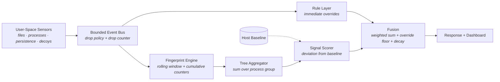

# GRIMA

GRIMA is a **user-space ransomware detector** built on behavioral fingerprinting. It
observes filesystem, process, and persistence activity through OS-provided user-space
APIs, folds that activity into per-process behavioral fingerprints over a rolling window,
and scores each process against a **baseline calibrated on the host it runs on**.

It is cross-platform by construction — one `Event` schema with per-OS adapters behind it —
and **verified on Windows and Linux** by CI. The macOS adapter ships but has never run on a
real host, so macOS coverage is not claimed. See [`docs/sprints.md`](docs/sprints.md) §10.

It does not install kernel drivers, does not require cgo, and does not use machine
learning. Detection rests on deterministic, explainable signals: multi-signal heuristic
fusion, a host-calibrated statistical baseline, and a hard-rule override layer. Every
alert can be read back as a sentence naming the signals that fired and their measured
deviations.

GRIMA is a single statically linked Go binary with no interpreter and no runtime
dependency install. The same source cross-compiles to Windows, Linux, and macOS with
`CGO_ENABLED=0`.

## Documentation

Full documentation is available in the [`docs/`](docs/) directory:

- [Project Plan](docs/plan.md) – Goals, design decisions, signal taxonomy, literature
  gaps and the mechanisms addressing them, roadmap, risks, and prior-art attribution.
- [Sprint Plan](docs/sprints.md) – Timeboxed schedule: workstreams, ownership, per-sprint
  deliverables, definition of done, critical path, and the cut list.
- [Architecture](docs/architecture.md) – Layer structure, dual-track fingerprinting,
  tree aggregation, concurrency model, failure modes, and component ownership map.
- [Design Specification](docs/design.md) – Authoritative interface reference: the frozen
  event contract, signal semantics, calibration model, fusion algorithm, and
  configuration surface.

Operational procedures live in [`SKILLS.md`](SKILLS.md). Repository working guidelines
are in [`AGENTS.md`](AGENTS.md). Borrowed code and licenses are recorded in
[`THIRD_PARTY_NOTICES.md`](THIRD_PARTY_NOTICES.md).

## Quick Start

Requires Go 1.26 or newer.

```bash
# Build the binary for the host platform
make build

# Run with the example configuration
make run

# Run for a bounded time (smoke test)
./grima --config configs/grima.example.toml --duration 30s

# Run tests
make test

# Format, vet, and lint
make fmt
make lint

# Cross-compile for all supported platforms
make cross
```

Or using the Go toolchain directly:

```bash
go build ./cmd/grima
go test ./...
CGO_ENABLED=0 GOOS=linux GOARCH=amd64 go build -o dist/grima-linux-amd64 ./cmd/grima
```

## Configuration

GRIMA runs with sensible defaults and no configuration file, in observe-only mode. The
annotated example at [`configs/grima.example.toml`](configs/grima.example.toml)
documents every option.

The three settings that matter most:

| Setting | Purpose |
|---|---|
| `general.monitor_paths` | Directories to watch. Anything outside this set is invisible. |
| `calibration.warmup` | How long to observe the host before deviation signals activate. |
| `response.enable_suspend` | Off by default. Terminating processes on a heuristic score is a denial-of-service risk. |

### Calibration

Deviation-based signals require a host baseline. Capture one on the machine you intend to
monitor, during representative activity:

```bash
./grima --config configs/grima.example.toml --calibrate --duration 10m
```

Until a baseline exists, GRIMA runs in **uncalibrated mode**: rule overrides and absolute
fallback thresholds still fire, deviation signals are suppressed, and the dashboard shows
a persistent banner. An operator never mistakes "quiet" for "calibrated and quiet."

## How it works



Two design commitments do most of the work:

- **Dual-track accumulation.** A decaying rolling window catches bursts; a non-decaying
  cumulative counter catches drip encryption. Either alone is evadable.
- **Tree aggregation before scoring.** Ransomware that splits work across cooperating
  processes keeps each child below threshold; summing across the process group
  reconstructs the behavior no single process exhibits.

## Status

The pipeline (sensors → bus → fingerprint → scoring → dashboard) is wired end to end and
verified on Windows: a benign workload produces no alerts, and a controlled encryptor is
detected at critical with named evidence.

Current work is Sprint 1 of [`docs/sprints.md`](docs/sprints.md) — making the sensors
trustworthy rather than merely functional. Non-Windows hosts are out of scope for
evaluation (§10).

The evaluation harness (Sprint 4) is the project's contribution. Everything before it is
infrastructure.

## License

See [`LICENSE`](LICENSE). Third-party components are listed in
[`THIRD_PARTY_NOTICES.md`](THIRD_PARTY_NOTICES.md).
