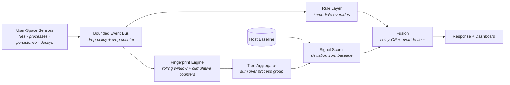

# GRIMA

GRIMA is a **user-space ransomware detector** built on behavioral fingerprinting. It
observes filesystem, process, and persistence activity through OS-provided user-space
APIs, folds that activity into per-process behavioral fingerprints over a rolling window,
and scores each process against a **baseline calibrated on the host it runs on**.

It is cross-platform by construction — one `Event` schema with per-OS adapters behind it —
and **verified on Windows and Linux** by CI. The macOS adapter ships but has never run on a
real host, so macOS coverage is not claimed. See [`docs/sprints.md`](docs/sprints.md) §10.

It does not install kernel drivers, does not require cgo, and does not use machine
learning. Detection rests on deterministic, explainable signals: multi-signal heuristic
fusion, a host-calibrated statistical baseline, and a hard-rule override layer. Every
alert can be read back as a sentence naming the signals that fired and their measured
deviations.

GRIMA is a single statically linked Go binary with no interpreter and no runtime
dependency install. The same source cross-compiles to Windows, Linux, and macOS with
`CGO_ENABLED=0`.

## Documentation

Full documentation is available in the [`docs/`](docs/) directory:

- [Project Plan](docs/plan.md) – Goals, design decisions, signal taxonomy, literature
  gaps and the mechanisms addressing them, roadmap, risks, and prior-art attribution.
- [Sprint Plan](docs/sprints.md) – Timeboxed schedule: workstreams, ownership, per-sprint
  deliverables, definition of done, critical path, and the cut list.
- [Architecture](docs/architecture.md) – Layer structure, dual-track fingerprinting,
  tree aggregation, concurrency model, failure modes, and component ownership map.
- [Design Specification](docs/design.md) – Authoritative interface reference: the frozen
  event contract, signal semantics, calibration model, fusion algorithm, and
  configuration surface.

Operational procedures live in [`SKILLS.md`](SKILLS.md). Repository working guidelines
are in [`AGENTS.md`](AGENTS.md). Borrowed code and licenses are recorded in
[`THIRD_PARTY_NOTICES.md`](THIRD_PARTY_NOTICES.md).

## Requirements

| | |
|---|---|
| Go | 1.26 or newer (`go version`) |
| Build | `make`, or the `go` toolchain directly |
| Fixtures and harnesses | Python 3, and a POSIX shell |
| Windows | **Git Bash** for the shell scripts — see [Platform notes](#platform-notes) |

No elevation is needed for the default configuration. `attribution.mode = "audit"` does
need an elevated process, and is off by default.

## Build

```sh
make build          # CGO_ENABLED=0, statically linked, host platform
./grima --version
```

Directly, if `make` is unavailable:

```sh
CGO_ENABLED=0 go build -trimpath -o grima ./cmd/grima
```

`CGO_ENABLED=0` is mandatory for release builds; the cross-platform, dependency-free claim
depends on it. `make cross` builds linux/amd64, linux/arm64, windows/amd64 and darwin/arm64
into `dist/`.

## Run it

### 1. Configure

```sh
cp configs/grima.example.toml grima.toml
```

Edit `general.monitor_paths`. **The example lists `/home` and `/srv`** — Linux paths. Use
absolute paths for the host you are on, for example:

```toml
[general]
monitor_paths = ["C:/Users/you/Documents"]
```

Anything outside that list is invisible to the detector, and GRIMA **rejects unknown
configuration keys** rather than ignoring them, so a typo fails at startup instead of
silently disabling a setting.

### Decoys write files into the directories you monitor

GRIMA plants canary files so that a process touching one is caught immediately. That is a
change to your filesystem, so it is worth knowing before the first run:

- By default the canaries go in the monitored directories themselves and **nowhere deeper**
  (`decoy.max_depth = 0`). Setting it higher plants `count_per_dir` files in every directory
  down to that depth, which on a home directory is a lot of files.
- Every planted path is recorded in `decoy.manifest_path` (default `grima-decoys.json`), and
  the run is undone with:

  ```sh
  grima --config grima.toml --remove-decoys
  ```

  It removes exactly the recorded files, and only while their contents are still the canary
  body — a decoy you replaced with a real document is left alone. Set `decoy.enabled = false`
  to skip planting entirely.

### 2. Calibrate

```sh
./grima --config grima.toml --calibrate
```

The warm-up length comes from `calibration.warmup` (15 s by default). Calibration captures
the host's own entropy-by-extension distributions, write/rename/delete rates, and directory
fan-out. **Run it while the machine is doing representative work**: a baseline captured on
an idle host makes ordinary activity look like a deviation, and the detector will flag it.

Expect:

```
msg="capturing host baseline" warmup=15s
msg="baseline written" path=.../baseline.json extensions=<n> processes=<n>
```

The baseline is written to `calibration.baseline_path`. Until one exists, GRIMA runs in
**uncalibrated mode**: rule overrides and absolute fallback thresholds still fire, deviation
signals are suppressed, and the dashboard says so. "Quiet" is never mistaken for "calibrated
and quiet."

### 3. Run

```sh
./grima --config grima.toml                # until interrupted
./grima --config grima.toml --duration 1h  # bounded
```

Healthy startup:

```
msg="platform detected" os=windows
msg="watching directories" source=filewatch count=403
msg="dashboard listening" url=http://127.0.0.1:8787
```

Detection is observe-only by default. To let a critical verdict suspend the offending
process, set `response.enable_suspend = true` (it requires `suspend_min_level = "critical"`);
terminating processes on a heuristic score is a denial-of-service risk, so it is opt-in.

If a legitimate workload keeps alerting and you have confirmed it is benign, fold a fresh
window into the existing baseline rather than starting over:

```sh
./grima --config grima.toml --recalibrate
```

### 4. Watch it

| Endpoint | What it gives you |
|---|---|
| `http://127.0.0.1:8787/` | Dashboard: a **risk timeline** (score over time, band lines at 20/45/70/88, points coloured by level), a **findings feed** (newest first, at or above the configured alert level, with the signal sentences), a **signal panel** (which evidence is doing the work), and the per-process tree view |
| `/healthz` | The honest counters — `calibration_ready`, `bus_published`/`bus_dropped`, and per sensor `Events`, `Dropped`, `watch_failures`, `add_pending` |
| `/api/verdicts` | The current verdicts as JSON, with the signals and values behind each one |
| `/api/trees` | Verdicts grouped by tree root with their contributing processes |
| `/api/history` | The recorded verdict history, oldest first — the timeline and findings the dashboard draws. Bounded in memory, with the overwritten count beside it |
| `/events` | Server-sent events stream of new verdicts |

Alerts also go to the log as one line each:

```
msg="ransomware risk detected" pid=0 process=(host) score=100.0 level=critical \
    signals="entropy_deviation; magic_mismatch; unknown_extension_activity"
```

A drop counter that moves (`bus_dropped`, `Dropped`, `add_pending`, `watch_failures`) means
the detector is telling you it lost events. It never drops silently — if a number there is
non-zero, read it before trusting a quiet period.

## Verify it

```sh
make lint    # gofmt check + go vet
make test    # the full suite
make race    # the full suite under the race detector
```

End-to-end, with no real malware involved:

```sh
"C:/Program Files/Git/bin/bash.exe" testdata/scenarios/smoke.sh    # Windows
bash testdata/scenarios/smoke-linux.sh                            # Linux
```

The smoke test captures a baseline, runs a benign rewrite that must stay silent, then runs
the controlled encryptor that must alert at critical with named evidence. Exit 0 is a pass;
it prints every verdict it saw.

## Reproduce the measurements

These are the harnesses behind the numbers in `docs/sprints.md`. Each starts its own
detector on its own port, prints its evidence, and exits non-zero when a check fails.

| Command | What it measures | Roughly |
|---|---|---|
| `testdata/scenarios/rates.sh` | drip, intermittent and head+tail entropy detection; the cumulative track carrying a verdict alone | 6 min |
| `testdata/scenarios/cerberus.sh` | the cooperative multi-process split, against the shipped default and as an attribution characterisation | 3 min |
| `testdata/scenarios/benign-corpus.sh -n 2` | false positives over six benign workloads, with per-round spread | 20 min |
| `testdata/scenarios/overhead.sh` | detector CPU and RSS idle and under load, against a no-detector control | 2 min |
| `python testdata/scenarios/ablate.py --rounds 3` | the ablation table: detection rate at 1% FPR, time-to-detect in bytes, false positives per 24 h, per signal subset | 45 min/round |
| `python testdata/scenarios/ablate-figures.py results/ablation.json` | the ablation table, TTD distribution and ROC/PR sweeps | seconds |
| `python testdata/scenarios/tune-weights.py --ablation results/ablation.json` | weight tuning on a held-out split, with the held-out gap reported | seconds |

On Windows, run the shell harnesses through Git Bash
(`"C:/Program Files/Git/bin/bash.exe" <script>`); the Python harnesses run under any
Python 3 and take Windows-style paths.

## Platform notes

### PowerShell works for everything except the shell harnesses

The detector is a native Windows binary and every Python harness runs natively, so
PowerShell is a complete environment for running GRIMA. Only the five `.sh` scenario
scripts need a POSIX shell, and you can call Git Bash from PowerShell rather than working
inside it:

```powershell
cd C:\Users\you\Documents\grima

make build                                      # or: $env:CGO_ENABLED="0"; go build -trimpath -o grima.exe ./cmd/grima
Copy-Item configs\grima.example.toml grima.toml
(Get-Content grima.toml) -replace '^monitor_paths = .*',
    'monitor_paths = ["C:/Users/you/Documents/grima-demo"]' | Set-Content grima.toml

.\grima.exe --config grima.toml --calibrate
.\grima.exe --config grima.toml --duration 2m    # dashboard on http://127.0.0.1:8787

curl.exe -s http://127.0.0.1:8787/healthz        # curl.exe, not the Invoke-WebRequest alias
Invoke-RestMethod http://127.0.0.1:8787/api/verdicts | ConvertTo-Json -Depth 4

make lint; make test; make race

# The shell harnesses, driven from PowerShell:
& 'C:\Program Files\Git\bin\bash.exe' testdata/scenarios/smoke.sh
& 'C:\Program Files\Git\bin\bash.exe' testdata/scenarios/benign-corpus.sh -n 2

# The Python harnesses run natively:
python testdata/scenarios/encryptor.py --path C:\Users\you\Documents\grima-demo --rate burst
python testdata/scenarios/ablate.py --rounds 1
```

Four PowerShell-specific traps:

| Trap | What to do |
|---|---|
| `bash` resolves to the WSL launcher, which cannot see `C:\` paths | call Git Bash by full path: `& 'C:\Program Files\Git\bin\bash.exe' <script>` |
| `curl` is an alias for `Invoke-WebRequest`, with different arguments | use `curl.exe` |
| `python3` is a Microsoft Store stub that succeeds and then does nothing | use `python` |
| Environment variables are `$env:NAME="value"`, not `NAME=value cmd` | `$env:CGO_ENABLED="0"; go build …` |

`make` is used throughout these docs. `build`, `test`, `race`, `vet`, `fmt`, `fmt-check`,
`lint` and `run` work under PowerShell and `cmd` as well as a POSIX shell — the recipes use
no shell-specific syntax and `CGO_ENABLED=0` is exported by make rather than prefixed on the
command line. **`cross` and `clean` are POSIX-only** (a shell loop, and `rm -rf`); run those
from Git Bash, or use the direct equivalents:

```powershell
$env:CGO_ENABLED="0"
$env:GOOS="linux"; $env:GOARCH="amd64"; go build -trimpath -o dist/grima-linux-amd64 ./cmd/grima
Remove-Item grima.exe, dist -Recurse -Force
```

If `make` is not installed at all, every target has a direct equivalent (`go build`,
`go test`, `go vet`, `gofmt -l .`).

### Everything else

- **Windows: use Git Bash for the shell scripts.** A `bash` that resolves to the WSL
  launcher cannot see `C:/` paths, and its `/tmp` is not a directory the detector can watch.
  The harnesses fail fast when their work root is not drive-lettered rather than reporting
  an empty baseline.
- **`python3` on Windows may be a Microsoft Store stub** that exits successfully and then
  fails to open any script. The harnesses probe the interpreter before using it and fall
  back to `python`; override with `GRIMA_*_PYTHON` if needed.
- **Run one measurement at a time.** Each harness starts a detector on its own port
  (8794, 8795, 8797, 8798, 8802, 8805, 8808, 8809, 8811 — the dashboard default is 8787).
  Two at once means contention, and rate-based numbers stop meaning anything.
- **Attribution.** `attribution.mode` decides where evidence is filed. The default is
  `host`: no per-process claim is made, so no process is blamed wrongly, and it needs no
  privileges. `correlate` blames the largest recent byte-writer and was measured at 0%
  accuracy; `audit` takes the writer from Windows file-system auditing, needs elevation,
  and was measured at 96.9%. See `docs/sprints.md` §11, §14 and §20.

## Configuration

GRIMA runs with sensible defaults and no configuration file, in observe-only mode. The
annotated example at [`configs/grima.example.toml`](configs/grima.example.toml)
documents every option. The settings that matter most:

| Setting | Purpose |
|---|---|
| `general.monitor_paths` | Directories to watch. Anything outside this set is invisible. |
| `calibration.warmup` | How long to observe the host before deviation signals activate. |
| `filewatch.startup_deadline` | How long startup may spend registering watches on a large tree; the rest are registered in the background and counted as `add_pending`. |
| `response.alert_cooldown` | Hold repeat alerts for one incident. The example ships `1m`; the binary's own default is `0s`, which logs an identical line on every scoring tick. |
| `response.enable_suspend` | Off by default. Terminating processes on a heuristic score is a denial-of-service risk. |

## How it works


```mermaid
graph LR
    S["User-Space Sensors<br/><i>files · processes · persistence · decoys</i>"] --> B["Bounded Event Bus<br/><i>drop policy + drop counter</i>"]
    B --> R["Rule Layer<br/><i>immediate overrides</i>"]
    B --> F["Fingerprint Engine<br/><i>rolling window + cumulative counters</i>"]
    F --> T["Tree Aggregator<br/><i>sum over process group</i>"]
    C[("Host Baseline")] -.-> SC
    T --> SC["Signal Scorer<br/><i>deviation from baseline</i>"]
    R --> FU["Fusion<br/><i>noisy-OR + override floor</i>"]
    SC --> FU
    FU --> O["Response + Dashboard"]
```

Two design commitments do most of the work:

- **Dual-track accumulation.** A decaying rolling window catches bursts; a non-decaying
  cumulative counter catches drip encryption. Either alone is evadable.
- **Tree aggregation before scoring.** Ransomware that splits work across cooperating
  processes keeps each child below threshold; summing across the process group
  reconstructs the behavior no single process exhibits.

Signals combine as independent evidence (noisy-OR), never as an average, so adding a weak
signal cannot lower a score. Primary signals carry a verdict; Secondary signals corroborate
and fuse only while a Primary is present, so no combination of them can alert on its own.
Rule hits set a floor instead of being averaged in. See `docs/design.md` §8 and
`docs/sprints.md` §26.

## Status

The pipeline (sensors → bus → fingerprint → scoring → response → dashboard) is wired end to
end and verified on Windows and Linux by CI. Current work is **Sprint 4, the evaluation
harness** — the project's contribution; everything before it is infrastructure.

Measured so far: a benign corpus of six workloads stays below the alert band with a
calibrated baseline; the controlled encryptor is detected at critical with named evidence
within 128 KiB at the drip rate; detector overhead is 3.25% of one core idle and 6.11%
under load; and the ablation shows which signal subsets carry detection.

Stated as limits rather than claims:

- **Real ransomware families are unmeasured.** Only the controlled encryptor has been used;
  real families need an isolated snapshot VM, which the sprint's safety rules require.
- **The split-workload claim is measured only under host filing.** The per-process half
  needs causal attribution on an elevated host.
- **macOS ships but is unverified**, and Linux has no causal attribution source, so
  multi-process splitting is unaddressed there.

## License

See [`LICENSE`](LICENSE). Third-party components are listed in
[`THIRD_PARTY_NOTICES.md`](THIRD_PARTY_NOTICES.md).
