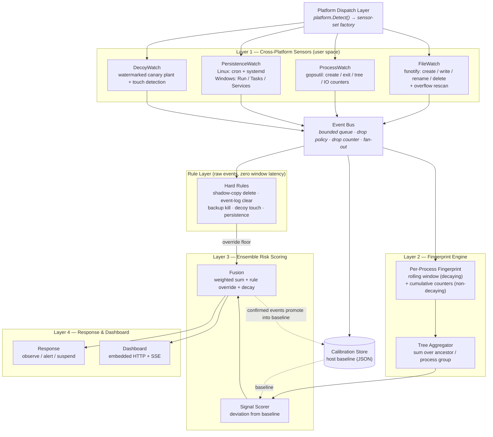
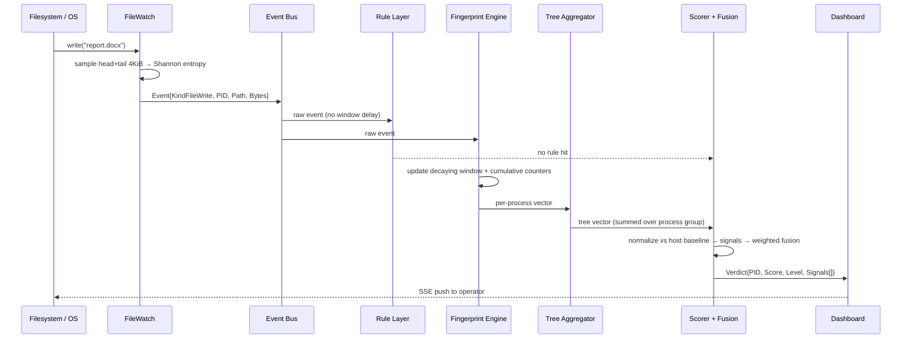

# GRIMA: Architecture — User-Space Sensing, Dual-Track Fingerprinting & Calibrated Fusion

This document defines the structural architecture of GRIMA. It explains how GRIMA
detects ransomware behavior entirely in **user space**, without kernel drivers or
pretrained models, by routing OS-provided filesystem, process, and persistence
notifications through a **bounded event bus** into a **dual-track fingerprint engine**
scored against a **host-calibrated statistical baseline**.

---

## Table of Contents

1. [Architectural Thesis](#1-architectural-thesis)
2. [The Layered Model](#2-the-layered-model)
3. [Platform Dispatch Layer](#3-platform-dispatch-layer)
4. [Layer 1 — Cross-Platform Sensors](#4-layer-1--cross-platform-sensors)
5. [The Event Bus](#5-the-event-bus)
6. [Layer 2 — Fingerprint Engine](#6-layer-2--fingerprint-engine)
7. [Tree Aggregation](#7-tree-aggregation)
8. [Layer 3 — Calibration & Ensemble Risk Scoring](#8-layer-3--calibration--ensemble-risk-scoring)
9. [The Rule Layer](#9-the-rule-layer)
10. [Layer 4 — Response & Dashboard](#10-layer-4--response--dashboard)
11. [End-to-End Dataflow](#11-end-to-end-dataflow)
12. [Concurrency Model](#12-concurrency-model)
13. [Failure Modes & Degradation](#13-failure-modes--degradation)
14. [Component Ownership Map](#14-component-ownership-map)

---

## 1. Architectural Thesis

Ransomware detection does not require kernel privilege. Kernel minifilter drivers see
more, but they cost system stability, portability, and deployability — and those costs
are why administrators disable them. User-space monitoring sees enough: file creation,
modification, rename and deletion; process creation, exit and I/O counters; persistence
mechanism writes. Those four streams, correlated and calibrated, are sufficient to
separate encryption behavior from legitimate bulk I/O.

Two design commitments follow:

1. **One event schema, many collectors.** Cross-platform support is a collector-factory
   problem. The scoring pipeline never learns which OS produced an event.
2. **Two time tracks, not one.** A decaying rolling window catches bursts. A
   non-decaying cumulative counter catches drip encryption. Either alone is evadable;
   the pair is what makes the observation window non-stationary.

---

## 2. The Layered Model



---

## 3. Platform Dispatch Layer

`internal/platform` answers one question — which sensors does this host support — and
returns them behind the common `Source` interface.

```go
package platform

type Set struct {
    OS      string
    Sources []sensor.Source
}

func Detect(cfg config.Config) (Set, error)
```

| Host OS | FileWatch backend | ProcessWatch | PersistenceWatch | Status |
|---|---|---|---|---|
| Windows | `ReadDirectoryChangesW` (via fsnotify) | Windows API (via gopsutil) | Run/RunOnce keys, Scheduled Tasks, Startup folder | **Verified** — local runs and the `windows` CI job |
| Linux | `inotify` (via fsnotify) | `/proc` (via gopsutil) | cron, systemd units, `/etc/rc*` | **Verified** — the `ubuntu` CI job runs `smoke-linux.sh` against a real kernel |
| macOS | `FSEvents` (via fsnotify) | `sysctl`/libproc (via gopsutil) | LaunchAgents, LaunchDaemons, cron | **Compiles, unverified** — no macOS host has been run |

macOS is the only unverified platform. Do not claim it from compilation alone — see
`sprints.md` §10.

The layer is a **factory, not a processing stage**: it holds no state, consumes no
events, and its output is a slice of started sources. Drawing it as a peer of Layers
1–4 in a diagram overstates it.

---

## 4. Layer 1 — Cross-Platform Sensors

Every sensor implements one interface and emits one event type.

```go
package sensor

type Source interface {
    Name() string
    Start(ctx context.Context, out chan<- event.Event) error
    Close() error
}
```

### FileWatch

Backed by `fsnotify`, which maps to the native notification API per OS. Emits
`KindFileCreate`, `KindFileWrite`, `KindFileRename`, `KindFileDelete`.

Two operational hazards are handled explicitly rather than assumed away:

- **Overflow.** Windows' `ReadDirectoryChangesW` buffer can overflow, dropping events
  silently. On overflow, FileWatch re-scans the affected subtree and emits synthetic
  events so the window does not under-count.
- **Watch exhaustion.** Linux inotify has no recursive watch; `fsnotify` emulates
  recursion with one watch per directory and can exhaust `max_user_watches` on large
  trees. Watch failures are counted and surfaced, never swallowed.

FileWatch does not read every byte of every changed file. Entropy is computed over a
**head + tail sample** (default 4 KiB each), which bounds I/O cost under an encryption
storm and also catches partial/intermittent encryption that leaves the file's middle
region untouched.

### ProcessWatch

Backed by `gopsutil`. Emits `KindProcessStart` and `KindProcessExit`, and maintains a
per-process I/O counter snapshot used for attribution and for the write-rate EWMA.
Records the process tree (PID/PPID) so Layer 2 can aggregate.

### PersistenceWatch

Emits `KindPersistenceInstall` when a new persistence mechanism appears. This is the
signal class most likely to fire *before* mass encryption — ransomware commonly
establishes persistence first.

### DecoyWatch

Plants canary files in monitored directories and emits `KindDecoyTouch` on any write,
rename, or delete touching one. This is the highest-precision signal in the system: no
legitimate process has business touching a file the user never created. Each decoy
carries an identifier so post-incident analysis can attribute which decoy variant was
destroyed.

---

## 5. The Event Bus

```go
package bus

type DropPolicy uint8

const (
    DropOldest DropPolicy = iota
    DropNewest
    Block
)

func New(capacity int, policy DropPolicy) *Bus
func (b *Bus) Publish(ev event.Event)
func (b *Bus) Subscribe(name string, capacity int) <-chan event.Event
func (b *Bus) Stats() Stats
```

**A bounded bus is a deliberate choice.** An encryption storm *is* an overload
condition, and an unbounded queue converts overload into unbounded memory growth. The
bus applies an explicit policy and **counts every drop**.

Two consequences:

1. **Drops are a signal.** `Stats().Dropped` feeds a diagnostic signal. Sustained drops
   during a write storm are themselves evidence of the storm.
2. **Rules get a dedicated subscription.** The rule layer subscribes with a larger
   buffer than the fingerprint layer, because a dropped override event is worse than a
   dropped window sample. Rules are also evaluated on raw events, so they never wait
   for a window tick.

---

## 6. Layer 2 — Fingerprint Engine

The fingerprint engine maintains, per process, a **feature vector** split across two
independent time tracks. Samples live in a fixed-capacity ring, so state is bounded by
live process count rather than uptime.

```go
package fingerprint

type Window struct {
    // Decaying track — burst detection
    Writes        int
    Creates       int
    Renames       int
    Deletes       int
    Bytes         int64
    Dirs          map[string]struct{}
    Entropy       []EntropySample
    MagicTotal    int
    MagicMismatch int

    // Non-decaying track — slow-and-low detection
    CumFilesRewritten int64
    CumBytesRewritten int64
    ExtActivity       map[string]int64
}
```

### Why two tracks

A decaying window suppresses noise correctly and evades drip encryption completely:
one file per hour never accumulates enough mass inside any window to cross a threshold.
The cumulative track never decays, so sustained low-rate encryption eventually crosses
a threshold that no single window would reach. Decay and accumulation answer different
questions and both are required.

### N-gram ring — not implemented

An event-type n-gram (`write, write, rename, delete, write…`) would be a useful
discriminator between encryption and ordinary editing, and `window.ngram_length` exists
in configuration. **No n-gram feature is computed and no n-gram signal is emitted.** The
config key is dead.

The raw material is present — the sample ring records each event's `Kind` — but nothing
derives a sequence feature from it. Tracked as sprint item 2.1: implement it and emit a
signal, or delete the claim and the config key.

Until then, treat the n-gram as absent, and do not cite it as a signal in the paper.

---

## 7. Tree Aggregation

```go
package fingerprint

func (e *Engine) Aggregate(root int32) TreeVector
```

Per-process fingerprints are the input; the **tree aggregate** is what gets scored for
Gap 2. Ransomware that splits work across cooperating processes defeats any classifier
that examines processes in isolation, because each child stays below threshold. Summing
writes, renames, entropy deviations, and directory fan-out across the ancestor group
reconstructs the aggregate behavior that no single process exhibits.

Tree aggregation is computed **before** scoring, not after, so a split workload is
scored as one actor.

---

## 8. Layer 3 — Calibration & Ensemble Risk Scoring

### Calibration Store

```go
package calibrate

type Dist struct {
    Mean   float64
    StdDev float64
    N      int
}

type Baseline struct {
    Host            string
    CapturedAt      time.Time
    WarmupDuration  time.Duration
    EntropyByExt    map[string]Dist   // ".docx" → (4.2, 0.8)
    WriteRateByProc map[string]float64 // EWMA per process name
    HostEventRate   Dist
    DirFanout       Dist
}

func Capture(ctx context.Context, cfg config.Config) (*Baseline, error)
func Load(path string) (*Baseline, error)
func (b *Baseline) Save(path string) error
```

Calibration runs during a warm-up window and is persisted as plain JSON. There is no
training step and no model artifact: the baseline is a set of measured distributions.

**Cold start is explicit.** Before a baseline exists, GRIMA runs in *uncalibrated mode*:
override rules and absolute fallback thresholds still fire, but deviation-based signals
are suppressed and the dashboard says so. This is stated rather than hidden, because
Isolation Forest's undefined cold-start behavior is one of the weaknesses being avoided.

### Signal Scorer

```go
package score

type Signal struct {
    Name   string
    Value  float64  // normalized 0..1
    Detail string   // human-readable evidence
    Class  Class    // Primary | Secondary | Override
}

func (s *Scorer) Compute(tv fingerprint.TreeVector, b *calibrate.Baseline) []Signal
```

Each signal normalizes against the baseline — $z = (H - \mu_{ext})/\sigma_{ext}$ for
entropy, EWMA deviation for write rate, host percentile for fan-out — so thresholds are
per-host by construction rather than hardcoded.

### Fusion

```go
type Verdict struct {
    PID      int32
    Score    float64  // 0..100
    Level    Level    // Info | Low | Medium | High | Critical
    Signals  []Signal
    Override string   // rule ID that set the floor, if any
}
```

Fusion combines three terms:

1. **Weighted sum** over Primary and Secondary signals. Weights come from grid search
   over the calibration corpus (Phase 6) — empirical tuning, not learning.
2. **Override floor.** Any Override-class signal (rule hit, decoy touch, persistence
   install) sets a minimum level. Overrides cannot be averaged away.
3. **Decay.** The decaying track's contribution is reduced over time when nothing
   suspicious follows. The cumulative track is exempt from decay by construction.

### Feedback

Confirmed events promote into the baseline on recalibration, so a workload the operator
marks benign stops producing alerts. This closes the loop that the diagram shows from
fusion back to the calibration store.

---

## 9. The Rule Layer

```go
package rules

type Rule struct {
    ID          string
    Description string
    Severity    score.Level
    Match       func(event.Event) bool
}

func (e *Engine) Evaluate(ev event.Event) (Hit, bool)
```

Rules subscribe to the bus directly, bypassing the fingerprint engine, so a
`vssadmin delete shadows` is evaluated the instant it happens rather than at the next
window tick. Routing rules through Layer 2 would destroy the immediacy that makes them
useful.

Initial rule set, derived from published detection logic (Sigma corpus) with attribution
recorded in `THIRD_PARTY_NOTICES.md`:

| Rule ID | Trigger | Severity |
|---|---|---|
| `R-SHADOW-DELETE` | `vssadmin`/`wmic` shadowcopy delete, `wbadmin delete catalog`, `bcdedit recoveryenabled no` | Critical |
| `R-EVENTLOG-CLEAR` | `wevtutil cl` | Critical |
| `R-USN-DELETE` | `fsutil usn deletejournal` | High |
| `R-BACKUP-KILL` | Termination of backup/database service processes | High |
| `R-DECOY-TOUCH` | Any write/rename/delete on a decoy file | Critical |
| `R-PERSIST-INSTALL` | New cron entry, systemd unit, Run key, or Scheduled Task | Medium |
| `R-MASS-RENAME` | Rename burst to a previously-unseen extension | High |

---

## 10. Layer 4 — Response & Dashboard

### Response

```go
package response

type Action uint8

const (
    Observe Action = iota  // record only (default)
    Alert                  // emit to configured sink
    Suspend                // SIGSTOP / NtSuspendProcess
)
```

Default is **Observe**. Auto-termination driven by a heuristic score is a
denial-of-service primitive: a false positive that kills a database process is worse
than a missed detection that alerts. Suspension is opt-in and gated on a measured FPR
from Phase 6.

### Dashboard

Embedded HTTP server using `html/template` and Server-Sent Events. No JavaScript build
step, no framework, no CDN — the binary serves its own UI. Displays live per-process and
per-tree risk, the contributing signals with their deviations, current calibration
status, and bus health (drop counts).

---

## 11. End-to-End Dataflow



---

## 12. Concurrency Model

| Component | Concurrency |
|---|---|
| Each sensor | One goroutine per source, writing to the bus |
| Bus | Fan-out goroutines, one per subscriber channel |
| Rule layer | Single goroutine; rules are pure predicates over one event |
| Fingerprint engine | Single goroutine owning all window state — **no locks on the hot path** |
| Tree aggregator + scorer | Single goroutine, ticked at a fixed interval |
| Web | One goroutine per SSE connection |
| Baseline capture | Separate goroutine during warm-up only |

The fingerprint engine is deliberately single-writer. Window state is mutated by exactly
one goroutine, which removes lock contention from the hot path and makes the window
contents trivially reproducible for tests. This is the same reasoning that makes a
single-threaded deterministic scheduler attractive — it is cheaper than locking and it
is testable.

---

## 13. Failure Modes & Degradation

| Failure | Consequence | Handling |
|---|---|---|
| Filesystem event overflow | Window under-counts | Re-scan subtree, emit synthetic events, count the occurrence |
| inotify watch exhaustion | Some directories unmonitored | Log, count, surface in dashboard health |
| Bus saturation | Events dropped | Explicit drop policy + drop counter as its own signal |
| No baseline yet | Deviation signals unavailable | Uncalibrated mode: overrides, magic-byte checks, and an absolute write-rate fallback; stated in the UI |
| Attribution ambiguous | Wrong process blamed | Attribution confidence field; prefer tree-level attribution when per-process confidence is low |
| Monitor process killed | No detection | Documented limitation. Service supervision + out-of-process append-only log are the mitigation, not a solution. |

### Attribution accuracy is the weakest link

User-space notification APIs report *that* a file changed, not *who* changed it. GRIMA
correlates file events against per-process write-byte counters, and that heuristic has a
measured failure mode: **a process doing high-volume background I/O outcompetes a
process doing many small writes.**

Observed during smoke testing on a Windows host: an encryptor rewriting 65 small files
was attributed to `firefox.exe`, which was concurrently writing more bytes to its cache.
The detection was still correct — the evidence landed in one fingerprint and the verdict
fired at critical — but the blamed PID was wrong.

This matters because it corrupts two things: which process appears in the alert, and the
per-process write-rate baseline captured during calibration.

Mitigations in place: the attribution window is two process-sample intervals, so a
process that stopped writing is not blamed; confidence is reported on every event.

The real fix is causal attribution rather than correlation, and it does not require a
custom driver: **ETW** (`Microsoft-Windows-Kernel-File`) on Windows and **auditd** or
**eBPF** on Linux both report the writing PID directly and are OS-provided. That is
Phase 1 work, and attribution accuracy should be measured in Phase 6 alongside detection
rate.

### Alert repetition

A process that stays above a level threshold is re-reported on every scoring tick — once
per second by default. This is intentional (risk is continuous, not a point event) but it
means the log repeats while a condition persists. Operators who want one alert per
incident should dedupe on `(PID, level, Override)` in their log pipeline; per-process
alert throttling is a Phase 5 option.

---

## 14. Component Ownership Map

| Layer / Concept | Responsible Component | Package |
|---|---|---|
| OS detection, sensor-set selection | Platform dispatch | `internal/platform` |
| `Event` schema, `Kind` enum | Frozen contract | `internal/event` |
| Bounded queue, drop policy, fan-out | Bus | `internal/bus` |
| Filesystem events, entropy sampling | FileWatch | `internal/sensor/filewatch` |
| Process lifecycle, tree, I/O counters | ProcessWatch | `internal/sensor/procwatch` |
| Persistence mechanism detection | PersistenceWatch | `internal/sensor/persistwatch` |
| Canary planting + registry | Decoy planter | `internal/decoy` |
| File-event → process attribution | Attributor (correlation, or causal from Windows file-system auditing) | `internal/attrib` |
| Rolling window, cumulative counters | Fingerprint engine | `internal/fingerprint` |
| Process-tree summation | Tree aggregator | `internal/fingerprint` |
| Host baseline capture/persist/reload | Calibration store | `internal/calibrate` |
| Signal normalization, weighted fusion, decay | Scorer | `internal/score` |
| Hard rules + override floor | Rule engine | `internal/rules` |
| Observe / alert / suspend | Response | `internal/response` |
| Embedded HTTP + SSE UI | Dashboard | `internal/web` |
| Flag parsing, config load, signal handling | Entrypoint | `cmd/grima` |
| Wiring, event pumping, scoring loop, health | App | `internal/app` |
