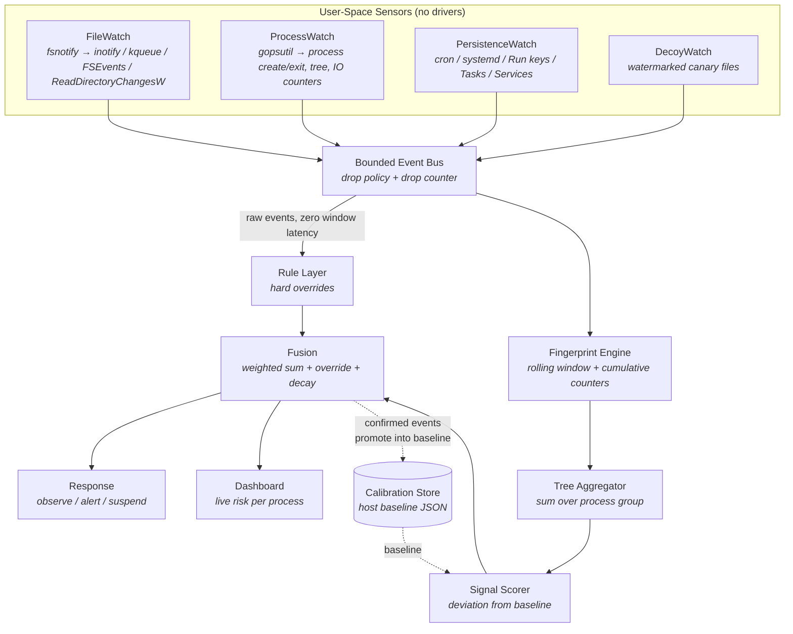

# GRIMA — Adaptive Multi-Layer Ransomware Detection Using Behavioral Fingerprinting

GRIMA is a **user-space, cross-platform ransomware detection system**. It observes
filesystem, process, and persistence activity through OS-provided user-space APIs,
folds that activity into a per-process behavioral fingerprint over a rolling window,
and scores each process against a **baseline calibrated on the host it runs on**.

GRIMA deliberately does **not** install kernel drivers, does **not** use machine
learning, and does **not** ship a pretrained classifier. Detection rests on
deterministic, explainable signals: multi-signal heuristic fusion, a host-calibrated
statistical baseline, and a hard-rule override layer. Every alert can be read back as
a sentence describing exactly which signals fired and by how much.

> **Architecture Focus:** GRIMA is a single statically linked Go binary with no
> interpreter and no runtime dependency install. The same source cross-compiles to
> Windows, Linux, and macOS via `CGO_ENABLED=0 GOOS=… GOARCH=… go build`. All sensing
> happens in user space through OS-provided notification APIs (`inotify`, `kqueue`,
> `FSEvents`, `ReadDirectoryChangesW`). No custom drivers, no kernel hooks, no
> pretrained model artifacts.

---

## Table of Contents

1. [Decisions](#1-decisions)
2. [What "Host-Calibrated Heuristic Detection" Means](#2-what-host-calibrated-heuristic-detection-means)
3. [Core Design (How Detection Is Achieved)](#3-core-design-how-detection-is-achieved)
4. [Signal Taxonomy](#4-signal-taxonomy)
5. [Literature Gaps and the Mechanisms That Address Them](#5-literature-gaps-and-the-mechanisms-that-address-them)
6. [Prior Art and Attribution](#6-prior-art-and-attribution)
7. [Roadmap](#7-roadmap)
8. [Risks](#8-risks)
9. [Non-Goals](#9-non-goals)
10. [Repo Layout](#10-repo-layout)
11. [Open Decisions](#11-open-decisions)

Architecture & layer mechanics: **`docs/architecture.md`**. Authoritative interfaces
and signal semantics: **`docs/design.md`**.

---

## 1. Decisions

| Decision | Choice | Rationale |
|---|---|---|
| Language | **Go 1.26**, `CGO_ENABLED=0` | Static single binary per platform with no interpreter or dependency install — the "lightweight" claim is materially true rather than asserted. Goroutines + channels map directly onto the sensor→bus→scorer pipeline without a GIL. |
| Detection paradigm | **Deterministic heuristic fusion** | Explainable by construction. No training set, no class imbalance, no dataset-generalization gap. Sidesteps the exact deployment-transfer failure that motivates host calibration. |
| Machine learning | **None** | Not required by any of the five target gaps (see §5). Removes the EMBER staleness problem, the Isolation Forest cold-start problem, and the Go ML-ecosystem gap in one decision. |
| Host adaptation | **Statistical baseline** (per-extension entropy μ/σ, per-process EWMA write rate, host-wide rate percentiles) | Host calibration is a *statistical* property, not a learning problem. Learned on the deployment host during a warm-up window and persisted as plain JSON. |
| Observation window | **Rolling window + non-decaying cumulative counters** (dual-track) | A sliding window alone is still a time window; drip encryption evades it. Irreversible actions accumulate on a counter that never decays. |
| Sensor interface | **One frozen `Event` schema, per-OS adapters** | Cross-platform support is a collector-factory problem, not a rewrite problem. One scoring pipeline consumes one event type. |
| Event delivery | **Bounded bus with explicit drop policy** | An encryption storm is an overload condition. Dropped events are counted and surfaced as their own signal, never silently ignored. |
| Process attribution | **Per-process fingerprints aggregated over the process tree** | Multi-process workload splitting defeats per-process classifiers; tree aggregation is the countermeasure. |
| Response model | **Observe-first** (alert + optional suspend), configurable | Auto-termination on a heuristic score is a denial-of-service risk. v1 defaults to observe; `suspend` is opt-in. |
| Distribution | **Single static binary + TOML config** | `grima --config grima.toml`. No service dependency, no database server. |
| State | **JSON baseline file + in-memory ring buffers** | Survives restart; no external store. |
| Dashboard | **Embedded HTTP + SSE, `html/template`** | No JS build step, no framework, no CDN. Served from the same binary. |

---

## 2. What "Host-Calibrated Heuristic Detection" Means



**"Calibrated" means measured on this host, not learned from a corpus.** During a
warm-up window GRIMA records what *this* machine's normal looks like:

- the Shannon entropy distribution $(\mu, \sigma)$ per file extension, so a `.docx`
  jumping from 4.2 to 7.9 bits/byte is a measurable deviation rather than a hardcoded
  threshold;
- an EWMA of write rate per process, so a compiler writing 200 files/s is not an alert
  while `svchost.exe` writing 200 files/s is;
- host-wide percentiles for file-event rate and directory fan-out.

**"Heuristic" means every score decomposes into named signals.** No opaque model
output. A high score is a list: *entropy deviation +4.1σ on 37 `.docx` files, magic-byte
mismatch, 340 writes/s across 12 directories, mass rename to unknown extension,
shadow-copy deletion rule hit.* That sentence is the alert.

---

## 3. Core Design (How Detection Is Achieved)

Detection rests on four cooperating mechanisms.

1. **Platform dispatch.** `platform.Detect()` reports the host OS and returns the
   matching sensor set. Sensors implement one interface; the pipeline above them is
   platform-agnostic.

2. **Dual-track accumulation.** Every process carries a *decaying* rolling window
   (burst detection, noise suppression) **and** a set of *non-decaying* cumulative
   counters for irreversible actions — distinct files rewritten, renames to a
   previously-unseen extension, shadow-copy/snapshot deletions. Decay is correct for
   suppressing noise and wrong for slow-and-low attacks; the two tracks are scored
   separately and the cumulative track wins on sustained low-rate encryption.

3. **Host-calibrated deviation scoring.** Each signal is normalized to a deviation
   from the host baseline rather than compared to a constant. Thresholds are therefore
   per-host and re-derived at each recalibration, which is what makes the system
   "adaptive" in a way that can be defined precisely: *per-host calibrated thresholds
   + rolling-window decay + periodic recalibration*.

4. **Rule override.** A small set of hard rules fires on raw bus events, bypassing the
   window entirely, so that `vssadmin delete shadows` raises the level immediately
   rather than at the next window tick. Rules cannot be averaged away by benign
   signals; they set a floor on the risk level.

---

## 4. Signal Taxonomy

| # | Signal | Source | Normalization | Weight class |
|---|---|---|---|---|
| 1 | Entropy deviation | `FileWatch` | $z = (H - \mu_{ext}) / \sigma_{ext}$ | Primary |
| 2 | Magic-byte mismatch | `FileWatch` | Boolean (file magic ≠ extension) | Primary |
| 3 | Write rate / burst | `FileWatch` | Deviation from per-process EWMA | Primary |
| 4 | Rename rate | `FileWatch` | Host-wide percentile | Primary |
| 5 | Rename-to-unknown-extension | `FileWatch` | Cumulative count | Primary |
| 6 | Delete rate | `FileWatch` | Deviation from per-process EWMA | Secondary |
| 7 | Directory fan-out | `FileWatch` | Host-wide percentile | Secondary |
| 8 | Bytes-rewritten cumulative | `FileWatch` | Cumulative count | Secondary |
| 9 | Persistence installation | `PersistenceWatch` | Boolean, typed | Override |
| 10 | Static reputation | `ProcessWatch` | PE header checks, section entropy, unsigned flag | Secondary |
| 11 | Rule hit | `RuleLayer` | Boolean, typed | Override |
| 12 | Decoy touch | `DecoyWatch` | Boolean | Override |
| 13 | Bus drop rate | `Bus` | Count per window | Diagnostic |

Signals 9, 11, and 12 are **overrides**: they set a minimum risk level rather than
contributing to a weighted average.

---

## 5. Literature Gaps and the Mechanisms That Address Them

The five gaps below are drawn from the ransomware-detection literature surveyed in the
project's review of the field. This table states which GRIMA mechanism addresses each —
it is a mapping, not a novelty claim.

| Gap | Description (from the literature) | GRIMA mechanism | ML needed? |
|---|---|---|---|
| 1 | Lack of cohesive cross-platform implementations; Windows-centric kernel tooling creates security silos | Platform dispatch layer + per-OS sensor adapters behind one `Event` schema; pure Go cross-compilation. **Verified on Windows and Linux in CI**; the macOS adapter ships but is unverified (see `sprints.md` §10) | No |
| 2 | Multi-process workload splitting blinds per-process classifiers | Tree aggregator sums fingerprints over the ancestor/process group before scoring | No |
| 3 | Methodological silos and single-threshold evasion (e.g. entropy alone, which 7-Zip defeats) | 13-signal fusion; rule overrides set a floor; entropy is conditioned on per-extension priors and paired with magic-byte checks | No |
| 4 | Rigid time-based thresholding fails against wait-timers and drip encryption | Dual-track accumulation: decaying window **plus** non-decaying cumulative counters | No |
| 5 | Lack of host-calibrated baselines; models trained on generalized corpora transfer poorly to deployment populations | Statistical host baseline learned during warm-up and persisted; all thresholds expressed as deviations from it | No |

**Every gap is addressable without ML.** This is the load-bearing observation behind
Decision §1: removing ML costs the design nothing in coverage of these gaps, while
removing three implementation problems (a stale pretrained model, an unsupervised
model's cold-start period, and the absence of a Go ML ecosystem).

**Prior work that addressed these gaps first.** Gap 1 is addressed in the literature by
kernel minifilter systems (UNVEIL, ShieldFS) and by user-space FSM approaches; Gap 3 by
RansomWall's layered fusion; Gap 5 by behavioral-fingerprinting work on
resource-constrained devices (Huertas Celdrán et al., *Computers & Security* 2023).
GRIMA's position is to *combine* these mechanisms in a user-space, cross-platform,
ML-free implementation and to **measure** the result. See §6.

---

## 6. Prior Art and Attribution

GRIMA reuses ideas and, where licensed permissively, code from existing projects. All
borrowed code is recorded in `THIRD_PARTY_NOTICES.md` with license and copyright. The
paper must cite these in Related Work.

**Design inspiration (no code taken):**

| Source | What GRIMA borrows |
|---|---|
| RansomWall (Shaukat & Ribeiro, COMSNETS 2018) | Layered defense: pre-execution check + decoy files + continuous filesystem monitoring; fusing entropy with additional checks rather than entropy alone |
| UNVEIL (Kharraz et al., USENIX Security 2016) / ShieldFS (Continella et al., ACSAC 2016) | The user-space-vs-kernel tradeoff analysis that motivates avoiding minifilters |
| Huertas Celdrán et al., *Computers & Security* 2023 (`10.1016/j.cose.2023.103510`) | Behavioral fingerprinting for ransomware detection |
| EldeRan (Sgandurra et al. 2016) | The fixed-observation-window weakness that motivates the rolling window |
| Davies & Macfarlane, *Sensors* 2022 | Comparison of entropy calculation methods for encrypted-file identification |
| SigmaHQ rule corpus | Detection logic for shadow-copy deletion, event-log clearing, and backup-service termination rules |

**Code reuse (recorded in `THIRD_PARTY_NOTICES.md`):**

| Project | License | Use |
|---|---|---|
| `fsnotify/fsnotify` | BSD-3-Clause | Cross-platform filesystem event notification |
| `shirou/gopsutil` | BSD-3-Clause | Process and system telemetry |
| `BurntSushi/toml` | MIT | Configuration parsing |

**Rejected for licensing or architectural reasons:** `nccgroup/KilledProcessCanary`
(kernel driver), `RafWu/RansomWatch` (Windows minifilter), any GPL/AGPL component
(licence is viral and would relicense the whole project).

---

## 7. Roadmap

Timeboxed ownership, per-sprint deliverables, and the definition of done live in
[`sprints.md`](sprints.md). This table is the phase view; that document is the schedule.

| Phase | Content | Exit criteria |
|---|---|---|
| 0 | **Docs & scaffolding** — `docs/`, `AGENTS.md`, `SKILLS.md`, Go module, frozen `Event` schema, `Source` interface, bus, compiling end-to-end pipeline | `go build ./...` and `go vet ./...` clean; binary starts, ingests events, prints verdicts |
| 1 | **Sensors** — `FileWatch` (fsnotify, with overflow handling), `ProcessWatch` (gopsutil), `PersistenceWatch` (Linux: cron/systemd; Windows: Run keys/Tasks/Services), `DecoyWatch` | Real file/process events observed on both Windows and Linux |
| 2 | **Fingerprint engine** — rolling window, per-process feature vector, dual-track cumulative counters, tree aggregator; resolve the n-gram gap (implement or delete) | Per-process fingerprints update live; tree aggregation sums a process group |
| 3 | **Calibration & scoring** — warm-up baseline capture, entropy-by-extension distributions, EWMA write rates, host percentiles, deviation normalization, weighted fusion, decay | Baseline persisted and reloaded; scores expressed as deviations, not constants |
| 4 | **Rules** — Sigma-derived hard rules with override semantics | Shadow-copy deletion raises level immediately, independent of window state |
| 5 | **Response & dashboard** — observe/alert/suspend, embedded HTTP + SSE live view | Operator sees live per-process risk in a browser |
| 6 | **Evaluation harness** — benign workload corpus, controlled encryptor (burst / drip / intermittent), ablation across signal subsets, TTD-in-bytes metric | Ablation table + FPR measurement on benign workloads; this is the paper's results section |
| 7 | **Cross-platform hardening** — macOS sensor set, packaging, docs | Same binary semantics on three platforms |

**Critical path note:** Phase 6 is the paper's contribution. Phases 0–5 are
infrastructure. If schedule pressure appears, the dashboard (Phase 5) is the correct
thing to cut, not the harness.

---

## 8. Risks

1. **Process→file attribution is correlation, not causation.** User-space APIs report
   *that* a file changed and *which* processes exist, but not always *which process
   wrote it*. Mitigation: attribute via `ReadDirectoryChangesW`/inotify event timing
   correlated with per-process I/O counters, and treat attribution confidence as a
   first-class field. If stronger attribution is needed later, ETW on Windows and
   auditd on Linux are OS-provided and still avoid custom drivers.
2. **Event loss under load.** `watchdog`-style buffers overflow during encryption
   storms; inotify has watch limits. Mitigation: handle overflow by re-scanning the
   subtree, and treat bus drop rate as its own signal rather than a silent failure.
3. **The monitor is a user-space process and can be killed.** Mitigation: run as a
   service, append-only log shipped out of process, separate watchdog process. This is
   a documented limitation, not a solved problem.
4. **False positives from legitimate bulk writers.** Backup tools, compilers,
   `npm install`, video export, rsync. Mitigation: host calibration plus per-process
   EWMA baselines; measured FPR is a required result, not an afterthought.
5. **Entropy is uninformative on already-compressed formats.** `.jpg`, `.mp4`, `.zip`,
   `.docx` are high-entropy before encryption. Mitigation: per-extension priors and
   magic-byte mismatch, not raw entropy.
6. **Decoy files are detectable.** A sophisticated attacker can skip files matching
   decoy naming. Mitigation: decoys are one override signal among several, not the sole
   defense.

---

## 9. Non-Goals

- **Kernel drivers or minifilters.** Explicitly out of scope; the stability and
  portability costs are the problem being avoided.
- **Pre-execution blocking of unknown binaries.** GRIMA observes behavior; it does not
  gate execution.
- **Decryption or file recovery.** GRIMA detects and alerts. It is not a backup system
  and does not attempt key recovery.
- **Network-level detection.** No traffic inspection, no C2 detection.
- **Machine learning.** See Decision §1.
- **macOS in Phases 0–6.** Cross-compilation is supported from Phase 0; the macOS
  sensor set lands in Phase 7.
- **macOS verification.** The adapter is written and compiles, but no macOS host has been
  exercised. Windows and Linux are verified in CI; macOS coverage is not claimed. See
  `sprints.md` §10.

---

## 10. Repo Layout

```
grima/
├── README.md                     ← project summary & quick start
├── AGENTS.md                     ← repository working guidelines
├── SKILLS.md                     ← operational runbook / procedures
├── THIRD_PARTY_NOTICES.md        ← borrowed code, licenses, copyright
├── go.mod / go.sum
├── Makefile                      ← build / test / lint / cross-compile targets
├── cmd/
│   └── grima/                    ← thin entrypoint: flags, config, logger, app.Run
├── internal/
│   ├── app/                      ← wiring, event pumping, scoring loop, health
│   ├── event/                    ← frozen Event schema + Kind enum
│   ├── bus/                      ← bounded queue, drop policy, fan-out, stats
│   ├── platform/                 ← OS detection + sensor-set factory
│   ├── sensor/                   ← Source interface + per-OS adapters
│   │   ├── filewatch/            ← fsnotify → file events, entropy, magic checks
│   │   ├── procwatch/            ← gopsutil → process create/exit, write volume
│   │   └── persistwatch/         ← cron/systemd (Linux), Run/Tasks/Services (Windows)
│   ├── attrib/                   ← file-event → process correlation
│   ├── decoy/                    ← canary planting + registry
│   ├── fingerprint/              ← rolling window, feature vector, tree aggregation
│   ├── calibrate/                ← host baseline capture, persistence, reload
│   ├── score/                    ← signal computation, normalization, fusion, decay
│   ├── rules/                    ← hard-rule engine + override semantics
│   ├── response/                 ← observe / alert / suspend actions
│   └── web/                      ← embedded dashboard, SSE endpoint
├── configs/
│   └── grima.example.toml        ← annotated example configuration
├── docs/
│   ├── plan.md                   ← this file
│   ├── sprints.md                ← timeboxed schedule, ownership, cut list
│   ├── architecture.md           ← layers, dataflow, ownership map
│   └── design.md                 ← authoritative interfaces & signal semantics
└── testdata/
    └── scenarios/                ← smoke test + controlled encryptor fixtures
```

---

## 11. Open Decisions

| # | Decision | Status |
|---|---|---|
| 1 | **Backronym for GRIMA.** Currently a codename only. Suggestion: *Guardian Runtime Integrity Monitor & Analyzer*. | Open — needs a call before the paper is titled |
| 2 | **Windows persistence sensor scope.** Run keys + Scheduled Tasks + Services is the minimum; WMI event subscriptions are a stretch goal. | Open |
| 3 | **Config format.** TOML chosen for comment support. JSON would drop one dependency. | Settled (TOML) |
| 4 | **Response default.** Observe-only in v1. Auto-suspend requires an FPR measurement first. | Settled (observe) |
| 5 | **macOS sensor set.** Phase 7, not Phase 0. | Settled (Phase 7) |
| 6 | **Whether the course expects an ML component.** The design is ML-free by choice; if the course rubric requires ML, that is a conversation to have before Phase 3. | Open — external |
