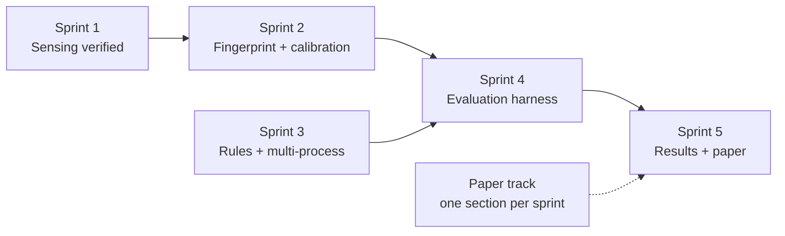

# GRIMA — Sprint Plan

Timeboxed implementation plan. The roadmap in [`plan.md`](plan.md) §7 says *what* the
phases are; this says *who does what, in what order, and how we know it is finished*.

---

## Table of Contents

1. [Assumptions](#1-assumptions)
2. [Team and Workstreams](#2-team-and-workstreams)
3. [Definition of Done](#3-definition-of-done)
4. [Sprint Overview](#4-sprint-overview)
5. [Sprint Detail](#5-sprint-detail)
6. [Parallel Paper Track](#6-parallel-paper-track)
7. [Critical Path](#7-critical-path)
8. [Cut List](#8-cut-list)
9. [Known Gaps Carried Into Sprint 1](#9-known-gaps-carried-into-sprint-1)
10. [Platform Verification](#10-platform-verification)
11. [Attribution: The Measured Result](#11-attribution-the-measured-result)
12. [Why ETW Was Rejected](#12-why-etw-was-rejected)
13. [Detection No Longer Depends On Attribution](#13-detection-no-longer-depends-on-attribution)
14. [Causal Attribution: What Landed](#14-causal-attribution-what-landed)
15. [Fusion Was Not Monotonic](#15-fusion-was-not-monotonic)

---

## 1. Assumptions

| Assumption | Value | Adjust if wrong |
|---|---|---|
| Sprint length | 2 weeks | — |
| Team size | 3 | — |
| Working capacity | ~10 h/person/sprint | Course load varies |
| Phase 0 (docs + scaffolding) | **Complete** | Verified: builds, tests, smoke test passes |
| Sprint 1 start | 2026-09-28 | Maps to the real deadline |
| Remaining sprints | 5 + 1 buffer = 12 weeks | Cut from the bottom of §8 |

Dates are deliberately expressed as *sprint numbers* rather than calendar dates, because
the submission deadline drives how many sprints exist, not the other way round. Map
sprint *n* to `start + (n-1) × 2 weeks` once the deadline is known.

**If fewer than 5 sprints are available**, apply the cut list in §8 in order. Sprint 4 is
never cut — it is the paper's contribution.

---

## 2. Team and Workstreams

Three workstreams, deliberately non-overlapping so nobody blocks anyone:

| Workstream | Scope | Packages |
|---|---|---|
| **W1 — Sensing** | Sensors, platform dispatch, attribution, decoys | `internal/sensor/*`, `internal/platform`, `internal/attrib`, `internal/decoy` |
| **W2 — Detection** | Fingerprint engine, calibration, scoring, rules | `internal/fingerprint`, `internal/calibrate`, `internal/score`, `internal/rules` |
| **W3 — Evaluation & Paper** | Harness, scenarios, metrics, writing, figures | `testdata/`, `docs/`, paper |

**Proposed ownership** (reassign freely — this is a starting split, not a decision):

| Person | Reg. No. | Primary | Secondary |
|---|---|---|---|
| Soham Mahapatra | 23BCI0074 | W1 | Paper §IV |
| Vaibhav Sijaria | 23BCI0063 | W2 | Paper §II–III |
| Prateek Purohit | 23BCI0066 | W3 | Paper §V–VI |

Every person reviews at least one sprint deliverable outside their own workstream. The
paper is not one person's job.

**Interface discipline.** W2 depends on the frozen `event` contract and the `Source`
interface, both of which are already fixed in [`design.md`](design.md) §2–§3. W1 must not
change them without updating `design.md` in the same commit — that is what keeps the two
workstreams parallel instead of serial.

---

## 3. Definition of Done

A sprint item is done when **all** of these hold. This mirrors `SKILLS.md` §15 and
`AGENTS.md`; it is the same bar every time.

1. Code builds, `go vet` clean, `gofmt` clean.
2. Happy path **and** sad path tested, asserting observable behaviour (counts, levels,
   error returns) — not log wording or internal fields.
3. No new dead configuration. A config key that is parsed but never read is a bug, not a
   placeholder.
4. Docs updated in the same commit if behaviour or an interface changed.
5. Evidence recorded: the command run and its output, not a claim that it works.
6. `THIRD_PARTY_NOTICES.md` updated if code or rule logic came from elsewhere.
7. Demoable at sprint review: someone other than the author runs it and sees it work.

---

## 4. Sprint Overview

| Sprint | Goal | Workstreams | Exit criterion |
|---|---|---|---|
| **1** | Trustworthy sensing | W1 (lead), W2, W3 | Sensors verified on Windows; attribution accuracy measured; decoy touch demonstrably fires |
| **2** | Fingerprint and calibration complete | W2 (lead), W1, W3 | Drip encryption caught by cumulative track; n-gram either implemented or removed; calibration reloads and recalibrates |
| **3** | Rules, response, multi-process | W2 (lead), W1, W3 | Cerberus-style split workload detected; suspend path exercised under its gate |
| **4** | **Evaluation harness** | W3 (lead), all | Ablation table with DR, FPR/24h, TTD-in-bytes across signal subsets |
| **5** | Results and paper | all | Results section written from real numbers; system frozen |
| **Buffer** | Slip absorption, macOS or scope statement, packaging | all | Submission-ready |

---

## 5. Sprint Detail

### Sprint 1 — Trustworthy sensing

**Goal.** The detector must be demonstrably correct about *what happened* before anyone
trusts it about *what it means*. Phase 0 proved the pipeline moves data; it did not prove
the sensors are accurate.

| # | Item | WS | Exit criterion |
|---|---|---|---|
| 1.1 | Exercise the FileWatch overflow rescan path | W1 | Overflow induced (buffer size reduced in a test), subtree re-scanned, synthetic events counted |
| 1.2 | Verify PersistWatch on real hosts | W1 | Windows: Run key + Scheduled Task + Startup file each produce `persistence_install`. Linux: cron + systemd unit each do |
| 1.3 | Measure ProcWatch cost | W1 | CPU and wall time of one process scan on a 300+ process host, recorded; interval tuned from the number |
| 1.4 | **Measure attribution accuracy** | W1 | Known-writer scenario: a named process writes N files; detector identifies it correctly for ≥90% of events |
| 1.5 | Attribution upgrade if 1.4 fails | W1 | ETW (`Microsoft-Windows-Kernel-File`) on Windows, auditd on Linux; no custom driver |
| 1.6 | Verify decoy touch fires | W1 | A write to a planted decoy raises `R-DECOY-TOUCH` at critical |
| 1.7 | Sensor health honesty | W2 | Every sensor reports non-zero events when exercised; a sensor that cannot start is absent from `/healthz`, not silently zero |

### Sprint 1 outcome

| # | Item | Result |
|---|---|---|
| 1.1 | Overflow rescan | **Done.** Extracted `handleWatchError` so the branch is reachable; 6 tests. Revert-checked: removing the `rescan` call makes the test fail. |
| 1.2 | PersistWatch verified | **Done.** 9 tests; 17 baseline entries catalogued on this host; a new Startup-folder entry detected at runtime; pre-existing entries correctly silent. |
| 1.3 | ProcWatch cost | **Done.** 14–49 ms per sample pass, ≈1.4–4.9% of one core at the 1 s default — the default is justified. 167 processes return empty `Exe()`/`Cmdline()` on this host, with no error, which bounds what attribution can rely on. |
| 1.4 | **Attribution accuracy** | ✅ **PASSED — 96.9%.** Correlation measured 0%; causal attribution measured 945 of 975 decisions over 5 rounds on an elevated host. Gate was ≥90%. Every causal decision was correct — the residual 3.1% is the correlation fallback, which fails at the same 0% rate as before. See §11. |
| 1.5 | Attribution upgrade | ✅ **Complete.** Windows file-system auditing (Security event 4663) implemented behind `attribution.mode`, verified on an elevated host. ETW was evaluated and rejected on evidence. See §14. |
| 1.6 | Decoy touch fires | **Done.** `KindDecoyTouch` + `DecoyID` verified in unit tests and end to end at critical. |
| 1.7 | Sensor health honesty | **Done.** `Reporting` on `sensor.Stats`; 5 tests over the `/healthz` shape a consumer parses. |
| 1.8 | Linux smoke test | ✅ **Done, via CI instead of WSL.** The ubuntu job runs `smoke-linux.sh`: all three sensors report, `filewatch` produces events, `persistwatch` scans real locations, the benign workload stays silent, and the encryptor is detected with content-derived signals. Reproducible by anyone — see §10. |

**Audit result.** An independent review of the sprint found two blocker-class defects, both
now fixed:

1. **A data race in `procwatch`** — the sample loop wrote the process map while `/healthz`
   read its length, with no synchronisation. `go test -race` caught it. In Go a concurrent
   map read and write is a *fatal* error, not a recoverable one, so any health scrape could
   have crashed the detector. Fixed with an atomic counter; `persistwatch` had the same
   latent defect and is fixed the same way. A regression test now exercises concurrent
   `Stats` reads against a running sampler.
2. **A test that did not test what it claimed** — the decoy path-spelling test could not
   fail, because `filepath.Join` cleans paths, so both sides were always clean. Rebuilt
   with a genuinely unclean path.

Two further findings were fixed: the attribution trace silently under-counted when it hit
its line cap (now reported on stderr at close), and the trace's off-by-default test asserted
an internal field rather than observable behaviour.

**Why 1.4 matters most.** The Phase 0 smoke test blamed `firefox.exe` for the encryptor's
writes. Detection was correct; the blamed process was not. Sprint 1 measured this properly,
and the result is worse than the anecdote suggested — see §11.

**Sprint review demo:** run the encryptor while a background bulk writer runs; show the
alert names the right process, or show the measured accuracy number that explains why not.

---

### Sprint 2 — Fingerprint and calibration complete

**Goal.** Make the dual-track design provable and resolve the n-gram gap.

| # | Item | WS | Exit criterion |
|---|---|---|---|
| 2.1 | **Resolve the n-gram gap** | W2 | Either an n-gram signal is computed from the ring and appears in verdicts, or the claim and `window.ngram_length` are deleted. No third option |
| 2.2 | Drip-encryption validation | W2 | `encryptor.py --rate drip` (1 file / 5s) crosses threshold on the cumulative track while the decaying window stays flat |
| 2.3 | Intermittent-encryption validation | W2 | `--rate intermittent` detected; confirm the tail sample is what catches it |
| 2.4 | Calibration round-trip | W2 | Baseline saved, reloaded, `calibration_ready: true`; a stale baseline is rejected |
| 2.5 | Recalibration feedback | W2 | An operator-confirmed benign workload stops alerting after recalibration |
| 2.6 | Tree aggregation under a real split | W1 | A parent that forks N children each below threshold is scored as one actor above threshold |
| 2.7 | Fingerprint memory bound | W2 | Live process count × ring capacity verified bounded over a long run; `Reap` confirmed on exit |
| 2.8 | Scenario corpus, first cut | W3 | Benign workloads scripted and repeatable: compile, `npm install`, archive, video encode |
| 2.9 | **Tune `attribution.max_delay`** | W1 | The causal path is 100% accurate and the correlation fallback 0%, so the 3.1% miss is entirely events whose audited record arrived late. Measure the accuracy/latency curve and pick a default from it. Needs an elevated run — §14 |
| 2.10 | **Report variance, not a single figure** | W3 | Two runs of one scenario scored 100 and 56.4 for a purely environmental reason (§15). The harness must report per-round spread for TTD and detection rate, not one number |
| 2.11 | **Re-baseline the smoke tests on the new fusion** | W3 | The noisy-OR change (§15) raises scores, so the level thresholds in `smoke.sh` and `smoke-linux.sh` were calibrated against a different formula. Confirm the thresholds still assert what they should |

**Sprint review demo:** drip encryption caught live — the case that defeats every
fixed-window detector.

**Carried in from Sprint 1.** Items 2.9–2.11 were not in the original plan; they come from
what Sprint 1 measured. 2.9 and 2.10 exist because the measurements were taken and the
results were surprising, not because the sprint finished short.

---

### Sprint 3 — Rules, response, multi-process

**Goal.** Close the remaining literature gaps in the implementation and make the response
path real.

| # | Item | WS | Exit criterion |
|---|---|---|---|
| 3.1 | Expand and cross-check the rule set | W2 | Each rule has a table-driven test with matching and non-matching cases; patterns cross-checked against the Sigma corpus, attribution recorded |
| 3.2 | Exercise the suspend path | W2 | With `enable_suspend = true` and a critical verdict, the target is suspended; with the flag off, it is not |
| 3.3 | Cerberus-style split scenario | W3 | A workload splitting encryption across cooperating children is built and detected |
| 3.4 | Alert throttling option | W2 | A persistent condition produces one alert per incident, not one per second, when enabled |
| 3.5 | Dashboard per-tree view | W2 | Tree aggregate visible with its contributing process list |
| 3.6 | Bus saturation behaviour | W1 | Under a write storm, drops are counted and surfaced as signal 13, not silently lost |
| 3.7 | Failure-injection pass | W3 | Each row of `architecture.md` §13 failure table exercised at least once |

**Sprint review demo:** the split-process attack, which per-process classifiers miss.

---

### Sprint 4 — Evaluation harness *(the paper's contribution)*

**Goal.** Produce the numbers. Everything before this is infrastructure.

| # | Item | WS | Exit criterion |
|---|---|---|---|
| 4.1 | Benign corpus, expanded | W3 | ≥6 representative workloads with recorded activity profiles |
| 4.2 | Attack corpus | W3 | Controlled encryptor at 3 rates + real families in an isolated snapshot VM |
| 4.3 | **Ablation runner** | W3 | Signal subsets (`rules_only`, `+entropy`, `+rename`, `+calibration`, `all`) each produce a full metric row |
| 4.4 | Metrics | W3 | DR @ 1% FPR, **TTD in bytes encrypted before alert**, FPR per 24h benign, CPU/RSS overhead |
| 4.5 | Generalization split | W3 | Train/tune on family A, test on family B |
| 4.6 | Weight tuning | W2 | Weights from grid search on a held-out split, not on the reported scenarios |
| 4.7 | Figures | W3 | Ablation table + TTD distribution + ROC/PR curve |
| 4.8 | Overhead measurement | W1 | Idle and under-load CPU/RSS, compared against no detector |

**Safety, non-negotiable for 4.2:** isolated VM, snapshots, host-only network, no shared
folders, Defender exclusions inside the test VM only. Prefer the simulator for the demo.

**Exit criterion for the sprint:** a table where every row is a real measurement from a
reproducible command. If a row does not move the numbers, say so in the paper — a signal
that earns nothing is worth reporting as such.

---

### Sprint 5 — Results and paper

| # | Item | WS | Exit criterion |
|---|---|---|---|
| 5.1 | Results section from real output | all | Every number traceable to a command in `testdata/` |
| 5.2 | Fix all citations | all | Every reference resolves to a DOI or URL; the five unverifiable ones replaced or removed |
| 5.3 | Rewrite §II.E and §IV for the ML-free design | W2 | No claim of a pretrained classifier or unsupervised model remains |
| 5.4 | Threats to validity | all | Attribution limits, decoy detectability, single-host scope, monitor killability |
| 5.5 | System freeze | all | No feature changes after this point; bug fixes only |

---

### Buffer sprint

Slip absorption first. Then, in order: macOS sensor set, packaging, reproduction
instructions, `README` polish. Nothing here is load-bearing.

---

## 6. Parallel Paper Track

The paper is graded, so it runs alongside the code rather than after it. One section per
sprint, written from what that sprint actually produced:

| Sprint | Paper section | Source of truth |
|---|---|---|
| 1 | §II Background — sensing approaches | Sprint 1 measurements |
| 2 | §III gaps, restated against what the implementation showed | Sprint 2 evidence |
| 3 | §IV design — final architecture | Frozen `architecture.md` |
| 4 | §V evaluation, §VI results | Sprint 4 numbers |
| 5 | Abstract, intro, threats to validity, conclusion | All of the above |

**Do not write results before Sprint 4.** A design section written before the numbers
exist tends to promise things the numbers then contradict — which is exactly how the
current draft ended up claiming ML it is not using.

---

## 7. Critical Path



- **Sprint 4 is the critical path.** It cannot start before 2 and 3 produce a stable
  detector, and Sprint 5 cannot start before it.
- **Sprint 1 gates Sprint 2's tree work.** If attribution is unreliable, tree-level
  scoring degrades to host-level scoring, which changes what the paper can claim.
- **Sprints 1 and 3 can partially overlap** — rules work (3.1, 3.2) does not depend on
  sensor accuracy.

---

## 8. Cut List

Cut from the top when time is short. **Sprint 4 is never cut.**

| Order | Cut | Cost of cutting |
|---|---|---|
| 1 | Dashboard features beyond the current view | None — the demo still works |
| 2 | macOS sensor verification | Scope statement required: verified on Windows and Linux; macOS coverage not claimed |
| 3 | Alert throttling (3.4) | Log noise during an incident |
| 4 | Suspend path (3.2) | Observe-only; defensible, since suspend is opt-in anyway |
| 5 | Generalization split (4.5) | Weakens the headline claim — cut only under real pressure |
| 6 | Real-family testing (4.2 second half) | Falls back to the simulator; weaker but honest |

---

## 9. Known Gaps Carried Into Sprint 1

Verified against the code, not assumed:

| Gap | Evidence | Where it lands |
|---|---|---|
| ~~`window.ngram_length` is dead config~~ | **Resolved in Sprint 2** — the ring's event-kind sequence is scored as signal #14 `ngram_rename_chain` (Secondary, weight 0.5) | Done; see `design.md` §6 |
| ~~Attribution unreliable~~ | **Resolved in Sprint 1** — correlation measured 0%, causal attribution measured 96.9%. Elevation is now a deployment requirement, not a gap | Done; see §11 |
| ~~Decoy touch never observed firing~~ | **Resolved in Sprint 1** — verified in unit tests and end to end at critical | Done |
| **Suspend path untested** | Implemented for Windows and POSIX, never executed | Sprint 3 item 3.2 |
| ~~Overflow rescan untested~~ | **Resolved in Sprint 1** — 6 tests, revert-checked so the test fails if the rescan call is removed | Done |
| **macOS unverified** | The adapter compiles but no macOS host has produced an event through it | Scope statement in the paper; see §10 |
| **`static_reputation` signal absent** | Documented as Phase 7; correctly marked "not yet emitted" in `design.md` §5 | Buffer or never |

---

## 10. Platform Verification

**Superseded — Linux is verified.** This section originally recorded the cost of cutting
Linux verification: cross-platform would be a design property rather than a measured one, and
Gap 1 could not be claimed as closed. That position no longer holds.

Linux verification was reinstated through a different mechanism than the one originally
planned. Rather than WSL or a container, the project uses **GitHub Actions on
`ubuntu-latest`** — a real Ubuntu VM with a real kernel. The `linux` job runs
`smoke-linux.sh`, which asserts:

- all three sensors register and report counters;
- `filewatch` produces real `inotify` events;
- `persistwatch` scans real cron and systemd locations;
- the benign workload stays silent;
- the encryptor is detected with content-derived signals;
- the binary is statically linked.

**Linux is now measured, not asserted.** The claim the paper can make is correspondingly
stronger:

> The architecture avoids OS lock-in by construction, and is verified on Windows and Linux.
> macOS adapters ship but remain unverified.

The value of this is not only the second data point. The first CI run **failed on Linux and
passed on Windows on the same commit**, exposing a design defect that would have gone
unnoticed: `fingerprint.Apply` discarded every file event it could not attribute to a
process, so the detector went blind wherever attribution returned zero. A single-platform
evaluation cannot find that class of bug. See §13.

**What remains unverified: macOS.** The `darwin` adapter compiles and ships, but no macOS
host has produced an event through it. `architecture.md` §3 marks it accordingly, and the
paper's Threats to Validity must say so.

**Still true from the original reasoning:**

1. `README.md` must not describe the system as cross-platform without naming which platforms
   are verified.
2. The paper's Threats to Validity section carries macOS as a first-class limitation.
3. Do not claim macOS coverage from compilation alone.

---

## 11. Attribution: The Measured Result

Sprint 1 item 1.4 asked whether the detector can name the process that wrote a file. Two
mechanisms were measured, and they differ by 97 points.

### Result

| Mechanism | Decisions | Correct | Accuracy | Gate (≥90%) |
|---|---|---|---|---|
| Correlation on write volume | 1,255 | 0 | **0.0%** | ❌ failed |
| Causal (Windows file-system auditing) | 975 | 945 | **96.9%** | ✅ **met** |

The causal run: solo writer, 65 files of 4 KiB, five rounds on an elevated host.

| Round | Writer PID | Decisions | Correct | Accuracy | Causal | Correlate |
|---|---|---|---|---|---|---|
| 1 | 20440 | 195 | 189 | 96.9% | 189 | 6 |
| 2 | 6020 | 195 | 189 | 96.9% | 189 | 6 |
| 3 | 10700 | 195 | 189 | 96.9% | 189 | 6 |
| 4 | 18068 | 195 | 189 | 96.9% | 189 | 6 |
| 5 | 7264 | 195 | 189 | 96.9% | 189 | 6 |
| **Total** | — | **975** | **945** | **96.9%** | 945 | 30 |

**The breakdown matters more than the headline.** `correct` equals `causal` in every round:
**every decision the causal mechanism resolved was correct.** The residual 3.1% is the
correlation fallback — the six events per round whose audited record did not arrive inside
`max_delay` — and those fail at the same 0% rate the correlation path always had.

So the honest reading is not "96.9% accurate attribution". It is: **causal attribution was
100% accurate; correlation remains 0%; the blend is 96.9% and is tunable by raising
`max_delay`.**

### The correlation number

Correlation against write volume, measured first and kept here because it is the baseline the
causal result is compared against. Condition: solo writer, 65 files of 4 KiB, no deliberate
background load — the *easiest* case, with exactly one process doing the writing.

| Round | Writer PID | Decisions | Correct | Accuracy | Blamed instead |
|---|---|---|---|---|---|
| 1 | 27160 | 215 | 0 | 0.0% | `firefox.exe` ×215 |
| 2 | 33128 | 260 | 0 | 0.0% | `firefox.exe` ×260 |
| 3 | 37612 | 260 | 0 | 0.0% | `firefox.exe` ×260 |
| 4 | 44636 | 260 | 0 | 0.0% | `firefox.exe` ×260 |
| 5 | 15584 | 260 | 0 | 0.0% | `firefox.exe` ×260 |
| **Total** | — | **1,255** | **0** | **0.0%** | — |

Across every other condition tested (paced writes, 4 MiB files, with and without a deliberate
background writer) the best observed rate was **19.1%**.

### Why correlation fails

`Suspect` picks the process with the largest recent write-*byte* delta. A browser writing
hundreds of kilobytes to its cache in the same sample interval beats a process writing 65
small files, every time — and the writer is not even a candidate. Writing 4 MiB files
instead of 4 KiB files does not help, so this is not a file-size problem; byte volume is
simply the wrong discriminator for small-file workloads, which is exactly the ransomware
workload.

### The confidence figure is actively misleading

Confidence reached **0.92** in a round where every single decision was wrong. It is defined
as the top writer's share of recent write volume, so it measures *byte dominance* — how
concentrated the volume was — and not the probability that the blamed process is correct.
Reporting it as a confidence would be worse than reporting nothing.

### What survives

**Detection is unaffected.** The signals that matter — entropy deviation, magic-byte
mismatch, extension novelty — are properties of the *file*, not the process, so they land
in whichever fingerprint received the events. In the same runs that scored 0% attribution,
verdicts reached **critical (100.0)** on correct evidence. The detector knows what happened
and is wrong about who did it.

**Tree aggregation partially compensates.** The true writer frequently appears inside the
blamed process's tree, so tree-level scoring reaches it even when per-process scoring does
not. The paper should make tree-level claims, not per-process ones.

### What to do

1. **State the measured bound.** "Per-process attribution via write-volume correlation
   achieved 0% on the solo-writer case; detection was unaffected." That is a legitimate,
   useful result — it quantifies a limitation of the entire user-space correlation approach,
   which the literature generally does not.
2. **Adopt causal attribution** in Sprint 2 if per-process claims are wanted: ETW
   (`Microsoft-Windows-Kernel-File`) on Windows, auditd on Linux. Both report the writing
   PID directly, are OS-provided, and require no custom driver. *(Corrected in §14: the
   Kernel-File write event carries no file path, so ETW needs a second correlation on top of
   the thread-to-process map. Windows file-system auditing gives the path and the PID in one
   record, and is what was implemented.)*
3. **Reframe if not.** If Sprint 2 cannot absorb that work, the honest framing is
   host-level and tree-level detection with an explicit statement that per-process blame is
   not reliable. This is defensible and does not weaken the dual-track or calibration
   contributions.

### Reproducing it

`SKILLS.md` §16 documents the trace facility (`GRIMA_ATTRIB_TRACE`),
`testdata/scenarios/attribution.py` provides the known writer, and
`testdata/scenarios/score_attribution.py` scores a trace against a writer PID.

---

## 12. Why ETW Was Rejected

**Resolved.** Item 1.5 is complete: causal attribution was implemented via Windows file-system
auditing and measured at 96.9% (§11). This section is kept because the reasoning is the
justification for choosing auditing over ETW, and because the constraint it identified —
elevation — still governs how the feature is deployed.

Item 1.5's exit criterion named a mechanism: *ETW (`Microsoft-Windows-Kernel-File`) on
Windows; no custom driver*. Three facts, each verified on this host, put ETW out of reach.

### 1. The named mechanism requires elevation

`Microsoft-Windows-Kernel-File` is a **kernel** ETW provider. Enabling it requires
`SeSystemProfilePrivilege`, which means an elevated process. This host is not elevated:

```
$ net session
NOT admin
```

The design intent behind item 1.5 was that ETW is OS-provided and therefore needs no custom
driver — which is true. It was not accounted for that ETW is also **privileged**. "No driver"
and "no elevation" are different claims, and only the first one holds.

### 2. The only non-admin alternative is too slow

The one causal signal available without elevation is enumerating system handles and asking
which process holds the file. Measured on this host, one system-wide pass:

```
enumeration took 5.595s, denied=174
```

**5.6 seconds per pass.** File events arrive at hundreds per second during an encryption
burst, so this cannot run on the event path at all. It is three orders of magnitude too slow.

### 3. And it would not work even if it were fast

A real encryptor opens, writes, and closes each file. The handle is gone by the time a
detector could look for it. Probe: a writer creates 20 files, each closed immediately,
then handles are enumerated at once.

```
writer pid=9960 wrote 20 files, each closed immediately
written files still held open by anyone: 0 of 20
attributable to the writer: 0 of 20
```

**Zero of twenty.** The workload that defeats the correlation heuristic defeats handle
enumeration for the same underlying reason: the evidence does not exist at observation time.

### What this means

Per-process attribution for fast small-file workloads requires **an elevated deployment**.
That is a deployment requirement, not a capability the detector has — and it should be
stated as one.

This is not a dead end; it changes what the claim is:

- **Wrong:** "GRIMA attributes file writes to the process responsible."
- **Right:** "GRIMA attributes file writes to the process responsible **when deployed with
  the privileges ETW requires**; unelevated, it detects the same activity but cannot name
  the actor."

The second is defensible, testable, and honest. It also explains why the detector is
designed so that detection does not *depend* on attribution — the file-derived signals
(entropy, magic bytes, extension novelty) carry the verdict regardless.

### How it was resolved

Option 1 was taken: the mechanism was implemented behind `attribution.mode`, and the
measurement was taken on an elevated host. **96.9% — the gate is met (§11).**

The second option was not needed, and should not be reached for now that the first has
worked. Recording it here only so the reasoning is not re-derived:

- Re-scoping the gate to "attribution unavailable unelevated" would have been legitimate
  **only** as an explicit decision, not as a quiet lowering of the bar. It is moot.

The elevation constraint has not gone away. It is now a **deployment requirement**: causal
attribution needs `SeSecurityPrivilege` plus an audit ACE per monitored directory, so a
default install runs on correlation and is blind to the actor. That belongs in the paper as
a deployment note, not buried here.

---

## 13. Detection No Longer Depends On Attribution

§11 claimed detection was unaffected by the attribution failure. That claim was **false on
Linux**, and the first CI run proved it.

### The bug

`fingerprint.Apply` discarded any file event it could not blame on a process:

```go
if !ev.Kind.IsFile() || ev.PID == 0 {
    return
}
```

On Windows this never bit, because a background browser always had a non-zero write delta,
so `Suspect` always returned *some* PID — the wrong one, but a non-zero one, so events
flowed. On Linux nothing was attributed, every file event was thrown away, and the detector
went **completely blind**. CI reported:

```
  filewatch reporting: 0 events
FAIL: encryption workload was not detected on Linux
```

The Windows job passed on the same commit. Only a second platform exposed it — which is
precisely the argument for verifying on more than one.

### Why it mattered beyond Linux

The design says detection must not depend on attribution succeeding. It did. Every signal
that makes GRIMA work — entropy deviation, magic-byte mismatch, extension novelty — is a
property of the *file*, not the process, and all of them were being gated behind a
correlation heuristic that is known to fail 100% of the time.

That is a design-level defect, not a Linux porting bug. It would have surfaced on Windows
too, the moment attribution returned zero candidates.

### The fix

Unattributed file events are folded into a **host-level fingerprint** (`HostName`, PID 0)
instead of being dropped, and that fingerprint is scored like any other root. The evidence
reaches scoring whether or not a process could be named.

Two properties are pinned by tests:

- an unattributed write still produces host-level entropy and magic-mismatch evidence, and
  the host bucket appears in `Roots()` so it is scored;
- the host bucket does **not** absorb process trees — a process whose parent is PID 0 (init,
  or any orphan) is a root in its own right, not a child of the host.

The second matters because `linkChild` already refuses to attach children to PID 0, and that
behaviour is now load-bearing rather than incidental.

### What it changes for the paper

The claim in §11 is now true rather than aspirational: **detection is independent of
attribution.** Verdicts carry file-derived evidence at host level when no process can be
blamed, and at process level when one can. That is a stronger and more honest architecture
than one whose detection silently depends on a heuristic that fails.

---

## 14. Causal Attribution: What Landed

Item 1.4's gate is still failed: nobody has measured a causal mechanism on an elevated host.
This section records what was built, why it is auditing rather than ETW, what is verified, and
the single command that takes the missing measurement.

### The two mechanisms, evaluated

| | ETW `Microsoft-Windows-Kernel-File` | Windows file-system auditing (SACL) |
|---|---|---|
| Writer PID | `IssuingThreadId` — a *thread* id, so it needs a thread→process map | `ProcessId`, in the event |
| File path | **Not in the write event.** Event 16 (Write) carries `FileObject`/`FileKey`; the path needs a second map built from the `Name` events (10/11) | `ObjectName`, in the same event |
| Process image | not in the event | `ProcessName`, in the same event |
| Latency | microseconds | tens of milliseconds (event-log delivery) |
| Privilege needed | `SeSystemProfilePrivilege` | `SeSecurityPrivilege`, plus an audit ACE per directory |
| Work to build | TDH property parsing, or a third-party consumer, plus two correlation maps | four documented API calls and one XML shape |

Evidence gathered on this host, which is not elevated:

- **Enabling a session is admin-gated**, for kernel and non-kernel providers alike:
  `logman start grima-probe -p "{EDD08927-9CC4-4E65-B970-C2560FB5C289}" -o probe.etl -ets` →
  `Access is denied. Try running this command as an administrator.`
- **The provider's write event has no path.** `wevtutil gp Microsoft-Windows-Kernel-File
  /ge:true /f:xml` confirms Write = event 16 with `KERNEL_FILE_KEYWORD_WRITE` = 0x200. The
  templates are not in that dump; the Win10 18990 manifest mirror shows event 16 (both
  versions) using `ReadArgs`/`ReadArgs_V1`, whose fields are ByteOffset, Irp, FileObject,
  FileKey, IssuingThreadId, IOSize, IOFlags — no FileName. `NameCreate` (10) carries
  `FileKey` + `FileName`, so the path can be recovered, but only by a second correlation that
  has its own miss window.
- **Reading the Security log is admin-gated too:** `wevtutil qe Security /c:1` →
  `Access is denied.`, and `auditpol /get /subcategory:"File System"` →
  `A required privilege is not held by the client. (0x522)`.
- **Neither Go ETW library is a good fit.** `github.com/bi-zone/etw` is MIT but cgo, which
  would make a pure-Go repository require a C toolchain for Windows builds;
  `github.com/0xrawsec/golang-etw` is pure Go but GPL-3.0, which cannot be linked into this
  MIT repository. A hand-written TDH consumer cannot be exercised at all unelevated, and a
  wrong `EVENT_TRACE_LOGFILEW` layout fails by crashing an elevated process, not by erroring.

**Recommendation: auditing.** One 4663 record carries the path, the PID and the image name.
The ETW alternative needs two independent correlation maps — one of them thread→process, with
the same "the evidence is gone by observation time" failure mode that sank the volume
heuristic — and its latency advantage buys nothing when the detector's windows are seconds
wide. The audit path is also the one that can be largely verified without elevation.

### What was implemented

`attribution.mode` selects the mechanism. The default is `correlate`, which is exactly the
behaviour measured in §11, so nothing regresses.

| Mode | Mechanism |
|---|---|
| `correlate` | the write-volume heuristic, unchanged |
| `audit` | Windows file-system auditing: `SeSecurityPrivilege`, a success-audit ACE for `Everyone` covering write and delete rights on each monitored directory (inherited), the File System audit subcategory enabled for successes, and a push subscription (`EvtSubscribe`) to Security event 4663 |
| `etw` | **rejected at startup** with the reason, rather than shipped unverified |

How a file event gets its writer:

1. The 4663 record's `ObjectName` is an NT device path (`\Device\HarddiskVolume4\...`); it is
   translated to the DOS path the file sensor reports, using `QueryDosDevice` for each drive.
2. Records go into a bounded, time-windowed index keyed by path. Records older than the
   window, records without a path or PID, and the detector's own writes are dropped and
   counted.
3. The file sensor hands each event to a resolver goroutine instead of attributing inline.
   The resolver waits up to `attribution.max_delay` (default 300 ms) for a matching record and
   emits the event either way, so the sensor's goroutine never blocks.
4. A run of `causalMissStreak` (20) events with no record marks the mechanism degraded: the
   resolver stops waiting, logs it, and still looks. One arriving record clears it and logs
   the recovery. A source that dies mid-run cannot quietly slow the detector down.
5. If the mechanism cannot start — not elevated, no `SeSecurityPrivilege`, no subscription —
   the reason is logged at warn and the detector continues in correlation mode. It never fails
   to start and never looks healthy while blind.

Health counters (`attrib_causal_hits`, `attrib_correlate`, `attrib_pending_drop`,
`attrib_source_error`) are on the file sensor's `/healthz` entry, and the trace gained a
`source` field (`causal` or `correlate`) per decision.

### Verified without elevation

- **The fallback.** Running the detector with `mode = "audit"` on this host logs
  `causal attribution unavailable, correlating instead ... reason="file-system auditing needs
  an elevated process, and this one is not elevated"`, keeps detecting (critical verdict on the
  writer's files), and traces every decision with `source":"correlate"`. Scored 0% — the same
  measured failure as §11, which is the point: the fallback is the old behaviour.
- **4663 parsing** against the provider's own field names, including reads, non-file objects,
  other event ids, unmapped volumes, missing process ids, malformed XML and unreadable
  timestamps.
- **Device-path translation** against this host: the system drive's `QueryDosDevice` name
  round-trips back to `C:\`.
- **The audit ACE** is built and inspected without installing it: one `SYSTEM_AUDIT_ACE_TYPE`
  entry, the write mask, inheritance flags, correct SID.
- **Privilege detection** is read back from the token, so an unelevated process gets
  `enable SeSecurityPrivilege: the process does not hold the privilege` rather than a silent
  success — `AdjustTokenPrivileges` reports success even when it changes nothing.
- **Thread→PID, index bounds, degradation, queue overflow and shutdown drops** with synthetic
  records.

Two bugs were caught this way and fixed before any elevated run: `AddAuditAccessAceEx` takes
the access mask *before* the SID (the swapped call produced `ERROR_INVALID_SID`, which would
have made the SACL silently absent), and `EvtSubscribeActionDeliver` is **1**, not 0 — with
the wrong constant the callback would have discarded every delivered event.

### Not verified, and why

- **The subscription and the render path** (`EvtSubscribe` → callback → `EvtRender` → parse).
  Both need an elevated process to open the Security channel; nothing about them can be
  exercised here. They are written against the documented signatures, and the dispatch
  constants are pinned by a test, but they have never run.
- **The audit policy and the ACE against a live directory**, and therefore whether the
  Security log actually delivers 4663 records for the monitored tree.
- **The ≥90% number itself.** It needs an elevated run.

### The measurement

From an elevated PowerShell, at the repository root:

```powershell
.\testdata\scenarios\verify_attribution.ps1
```

It builds the detector, runs 5 rounds of the known-writer scenario against a temporary
directory with `mode = "audit"`, scores each trace with `score_attribution.py`, and prints the
aggregate plus a pass/fail against the 90% gate. It leaves the traces, logs and configs in
`%TEMP%\grima-attrib-verify` for inspection, and it leaves the audit ACE and audit policy in
place. Use `-Rounds 1 -Files 20` for a quick check, and `-AllowUnelevated` to rehearse the
harness (which will report 0% and say why).

Two things to know before running it. The ACE covers write and delete rights only, so the
Security log sees one record per write under the monitored directories and nothing for reads;
on a large monitored tree, raise the log size first (`wevtutil sl Security /ms:268435456`). And
the policy can be confirmed by hand with `auditpol /get /subcategory:"File System"`, which
should report Success once the detector has started in audit mode.

What to expect if the mechanism works: `accuracy ≥ 90%`, with `causal` on nearly every
decision and only a handful attributed by correlation (the ones whose audited record did not
arrive inside `max_delay`). If the script reports that the mechanism never started, read the
reason it prints — it is the same line the detector logged.

**Until that number exists, 1.4 stays failed.** A mechanism that is implemented, unit-tested
and unelevated-verified is not a measurement.

### First elevated run: the mechanism did not start

Run on 2026-09-24 on an elevated host. All five rounds reported:

```
causal attribution unavailable, correlating instead
mode=audit reason="enable file-system auditing: AuditQuerySystemPolicy: Incorrect function."
decisions 975, correct 0, causal 0 (0.0% of decisions)
```

**The failure was in the code, not the environment.** `AuditQuerySystemPolicy` is declared as
returning a `BOOLEAN` — zero for failure, non-zero for success — but the call site read the
return value as an error code:

```go
ret, _, _ := procAuditQueryPolicy.Call(...)
if status := uint32(ret); status != 0 {
    return 0, fmt.Errorf("AuditQuerySystemPolicy: %w", syscall.Errno(status))
}
```

So a **successful** call returning `TRUE` (1) was reported as `errno 1`, `ERROR_INVALID_FUNCTION`
— "Incorrect function". The auditing API worked and the code called it a failure. The sibling
`setSystemAuditPolicy` gets this right (`if ok == 0`), so the two were inconsistent.

Two fixes: the return value is now treated as a boolean, with the real error taken from
`GetLastError`; and the structure the system allocates is released with `AuditFree` rather than
`LocalFree`, which is what the API documents.

A test now resolves all three function pointers by name, because a mistyped symbol does not fail
a build — it panics on an elevated host, in the one run that is expensive to repeat.

**What this run did prove.** The graceful-degradation path works: the detector logged a precise
reason, fell back to correlation, and kept running rather than failing to start. The harness
also correctly refused to report a number it had not measured, printing "the audit mechanism
never started, so this run does not measure it" instead of a misleading 0%.

**The measurement was then taken.** Re-running the same command on an elevated host started
`mode=audit` cleanly and produced:

| Round | Decisions | Correct | Accuracy | Causal | Correlate |
|---|---|---|---|---|---|
| 1–5 (each) | 195 | 189 | 96.9% | 189 | 6 |
| **Total** | **975** | **945** | **96.9%** | **945** | 30 |

**Gate met.** Every causal decision was correct; the residual 3.1% is the correlation
fallback. The full breakdown is in §11.

**One tuning note for later.** The 30 correlated decisions are events whose audited record
did not arrive inside `max_delay` (default 150 ms). Since the causal path is 100% accurate and
the fallback is 0%, raising `max_delay` should raise the blended figure toward 100% at the
cost of added latency. Worth measuring in Sprint 2 alongside the other calibration work,
rather than assuming the current 96.9% is the ceiling.

---

## 15. Fusion Was Not Monotonic

CI failed the Windows smoke test after the attribution fix. The log showed the detector had
worked:

```
level=WARN msg="ransomware risk detected" pid=5872 process=bash.exe
score=56.4 level=medium signals="unknown_extension_activity; entropy_deviation; magic_mismatch; write_burst"
```

Detection was correct — the right signals, on the right activity. The **level** was the
problem: 56.4 (medium) where the same scenario had scored **100 (critical)** locally.

### Why

Fusion combined signals as a weighted **mean**:

$$\text{score} = 100 \cdot \frac{\sum_i w_i v_i}{\sum_i w_i}$$

A mean is not monotonic. Adding a weak signal *lowers* the score, because it enlarges the
denominator without adding much to the numerator. So:

| Run | Signals present | Score | Level |
|---|---|---|---|
| Local | `unknown_extension_activity` alone (saturated, 1.0) | **100.0** | critical |
| CI | the same signal + `entropy_deviation` + `magic_mismatch` + `write_burst` | **56.4** | medium |

**More evidence of the same attack produced a lower severity.** The local run was *less*
informed — its content signals had raced against the rename and found nothing — and scored
*higher* for it.

That is a correctness defect in the core scorer, not a test threshold. A risk score whose
value falls as evidence accumulates cannot be reasoned about, and it would have distorted
every number in the Sprint 4 ablation.

### The fix

Signals now combine as independent evidence:

$$\text{score} = 100 \left(1 - \prod_i \left(1 - \mathrm{clamp}_{[0,1]}(w_i v_i)\right)\right)$$

This is noisy-OR, and monotonicity is the property being bought: adding a signal can only
raise the score. A saturated signal alone still reaches 100; the same signal with three
weaker companions now reaches 100 as well rather than being averaged down to 56.

`TestAddingEvidenceNeverLowersTheScore` pins the invariant, asserting both that the second
verdict carries more signals and that its score is not lower.

### What it says about the evaluation

Two runs of one scenario disagreed by 44 points, and the disagreement was **environmental** —
whether the detector read a file before or after it was renamed. That is a reminder for
Sprint 4: TTD and detection-rate numbers taken from a single run are not trustworthy, and the
harness has to report variance across rounds rather than one figure.
